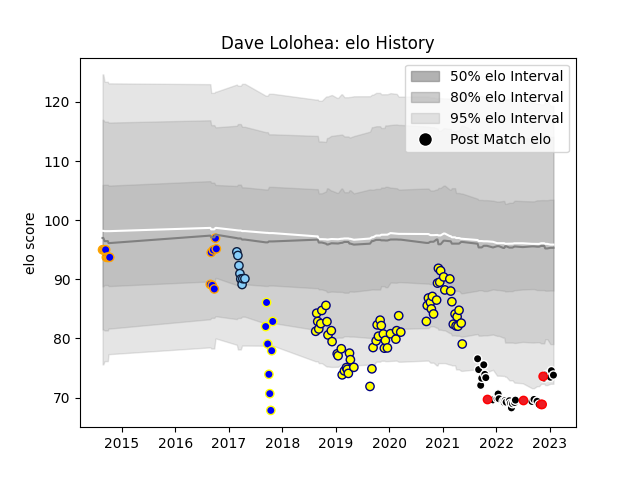

---  
layout: page  
title: Dave Lolohea  
date: 2023-02-02 19:01:32.771182  
categories: player  
---
# Dave Lolohea

## Positions: P

## Country: Tonga

## Current elo: 74.0

## Current Percentile: 6.0

# Elo History

# Match History

| Team                     |   Appearances |   Win Rate |
|:-------------------------|--------------:|-----------:|
| Nevers                   |            64 |   0.539062 |
| Provence Rugby           |            32 |   0.546875 |
| Greater Sydney Rams      |            15 |   0.366667 |
| New South Wales Waratahs |             8 |   0.25     |
| Sydney Rays              |             8 |   0.375    |
| Tonga                    |             5 |   0.6      |

| Opponent                   |   Matches |   Win Rate |
|:---------------------------|----------:|-----------:|
| Carcassonne                |         9 |   0.666667 |
| Aurillac                   |         7 |   0.714286 |
| Beziers                    |         7 |   0.785714 |
| Biarritz Olympique         |         7 |   0.571429 |
| Oyonnax                    |         7 |   0.357143 |
| Colomiers                  |         7 |   0.285714 |
| Vannes                     |         6 |   0.416667 |
| Rouen                      |         6 |   0.5      |
| Provence Rugby             |         5 |   0.4      |
| Soyaux-Angouleme           |         5 |   0.7      |
| US Bressane                |         4 |   0.625    |
| Montauban                  |         4 |   0.75     |
| Nevers                     |         3 |   0.333333 |
| NSW Country Eagles         |         3 |   0        |
| Perpignan                  |         3 |   0.333333 |
| Perth Spirit               |         3 |   0.666667 |
| Melbourne Rising           |         3 |   0.666667 |
| Mont-de-Marsan             |         3 |   0.666667 |
| Queensland Country         |         3 |   0.333333 |
| Canberra Vikings           |         3 |   0        |
| Brisbane City              |         3 |   0.333333 |
| Bayonne                    |         3 |   0.666667 |
| Grenoble                   |         3 |   0.5      |
| Valence Romans Drome Rugby |         2 |   0.5      |
| North Harbour Rays         |         2 |   0.25     |
| Brive                      |         2 |   0        |
| Southern Kings             |         1 |   0        |
| Sharks                     |         1 |   0        |
| Scotland                   |         1 |   0        |
| Spain                      |         1 |   1        |
| Sydney Stars               |         1 |   1        |
| Uruguay                    |         1 |   1        |
| Agen                       |         1 |   1        |
| Narbonne                   |         1 |   0        |
| Melbourne Rebels           |         1 |   1        |
| Massy                      |         1 |   1        |
| Lions                      |         1 |   0        |
| Hurricanes                 |         1 |   0        |
| Greater Sydney Rams        |         1 |   0        |
| Fijian Drua                |         1 |   1        |
| Fiji                       |         1 |   0        |
| Crusaders                  |         1 |   0        |
| Chile                      |         1 |   1        |
| Brumbies                   |         1 |   0        |
| Western Force              |         1 |   1        |