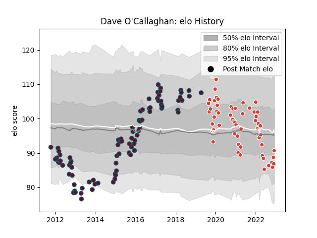

---  
layout: page  
title: Dave O'Callaghan  
date: 2022-12-18 16:17:43.396071  
categories: player  
---
# Dave O'Callaghan

## Positions: FL

## Current elo: 91.0

## Current Percentile: 30.0

# Elo History

# Match History

| Team               |   Appearances |   Win Rate |
|:-------------------|--------------:|-----------:|
| Munster            |            85 |   0.670588 |
| Biarritz Olympique |            57 |   0.45614  |

| Opponent                   |   Matches |   Win Rate |
|:---------------------------|----------:|-----------:|
| Cardiff Blues              |         9 |   0.666667 |
| Zebre                      |         8 |   1        |
| Benetton Treviso           |         8 |   1        |
| Scarlets                   |         8 |   0.5625   |
| Dragons                    |         8 |   0.75     |
| Ospreys                    |         6 |   0.5      |
| Edinburgh                  |         6 |   1        |
| Ulster                     |         5 |   0.5      |
| Perpignan                  |         5 |   0        |
| Leinster                   |         5 |   0.2      |
| Glasgow Warriors           |         5 |   0.6      |
| Oyonnax                    |         4 |   0.75     |
| Nevers                     |         4 |   0.25     |
| Saracens                   |         4 |   0.25     |
| Soyaux-Angouleme           |         4 |   0.75     |
| Carcassonne                |         4 |   0.5      |
| Colomiers                  |         3 |   0.666667 |
| Grenoble                   |         3 |   0.833333 |
| Rouen                      |         3 |   1        |
| Provence Rugby             |         3 |   1        |
| Aurillac                   |         3 |   0.666667 |
| Connacht                   |         3 |   0.666667 |
| Racing 92                  |         2 |   0        |
| Stade Toulousain           |         2 |   0.5      |
| Vannes                     |         2 |   0.5      |
| Montauban                  |         2 |   0.5      |
| Cheetahs                   |         2 |   1        |
| Leicester Tigers           |         2 |   0        |
| Clermont Auvergne          |         2 |   0        |
| Montpellier Herault        |         2 |   0        |
| Castres Olympique          |         1 |   0        |
| Beziers                    |         1 |   0        |
| Valence Romans Drome Rugby |         1 |   0        |
| Bordeaux Begles            |         1 |   0        |
| Toulon                     |         1 |   0        |
| Brive                      |         1 |   0        |
| Stade Francais Paris       |         1 |   0        |
| Northampton Saints         |         1 |   1        |
| Southern Kings             |         1 |   1        |
| Sale Sharks                |         1 |   1        |
| La Rochelle                |         1 |   1        |
| Massy                      |         1 |   1        |
| Mont-de-Marsan             |         1 |   0.5      |
| Pau                        |         1 |   0        |
| Aironi                     |         1 |   0        |