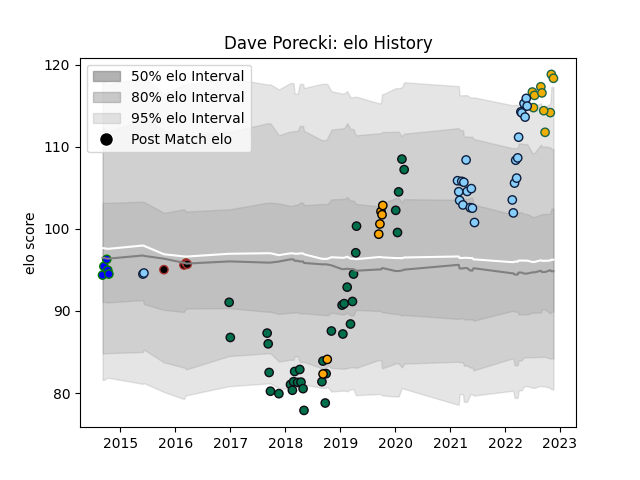

---  
layout: page  
title: Dave Porecki  
date: 2022-11-22 11:46:40.178190  
categories: player  
---
# Dave Porecki

## Positions: H

## Country: Australia

## Current elo: 118.0

## Current Percentile: 96.0

# Elo History

# Match History

| Team                     |   Appearances |   Win Rate |
|:-------------------------|--------------:|-----------:|
| London Irish             |            35 |   0.571429 |
| New South Wales Waratahs |            27 |   0.296296 |
| Australia                |            10 |   0.3      |
| NSW Country Eagles       |             7 |   0.214286 |
| North Harbour Rays       |             5 |   0.3      |
| Saracens                 |             4 |   0.625    |

| Opponent            |   Matches |   Win Rate |
|:--------------------|----------:|-----------:|
| Western Force       |         6 |   0.5      |
| Queensland Reds     |         4 |   0        |
| Melbourne Rebels    |         3 |   0.333333 |
| Brisbane City       |         3 |   0        |
| Brumbies            |         3 |   0        |
| Fijian Drua         |         3 |   0.833333 |
| Sale Sharks         |         3 |   0.5      |
| Richmond            |         3 |   1        |
| Harlequins          |         3 |   1        |
| Exeter Chiefs       |         3 |   0        |
| Northampton Saints  |         3 |   0.333333 |
| England             |         3 |   0.333333 |
| Bath Rugby          |         2 |   0        |
| Jersey              |         2 |   0.5      |
| Queensland Country  |         2 |   0.5      |
| New Zealand         |         2 |   0        |
| Nottingham          |         2 |   1        |
| South Africa        |         2 |   0.5      |
| Wasps               |         2 |   0        |
| Highlanders         |         2 |   0.5      |
| Hurricanes          |         2 |   0        |
| Coventry            |         2 |   1        |
| Bedford             |         2 |   1        |
| Blues               |         2 |   0        |
| Canberra Vikings    |         2 |   0.25     |
| Gloucester Rugby    |         1 |   0        |
| Worcester Warriors  |         1 |   1        |
| Sydney Stars        |         1 |   0        |
| Scotland            |         1 |   1        |
| Saracens            |         1 |   0        |
| Cardiff Blues       |         1 |   1        |
| Cheetahs            |         1 |   1        |
| Chiefs              |         1 |   0        |
| Cornish Pirates     |         1 |   1        |
| Hartpury College    |         1 |   1        |
| Crusaders           |         1 |   0        |
| Doncaster           |         1 |   1        |
| NSW Country Eagles  |         1 |   0        |
| Moana Pasifika      |         1 |   1        |
| Ealing Trailfinders |         1 |   1        |
| London Irish        |         1 |   1        |
| Lions               |         1 |   0        |
| Leicester Tigers    |         1 |   0        |
| France              |         1 |   0        |
| Ireland             |         1 |   0        |
| Bayonne             |         1 |   0        |
| Yorkshire Carnegie  |         1 |   0        |