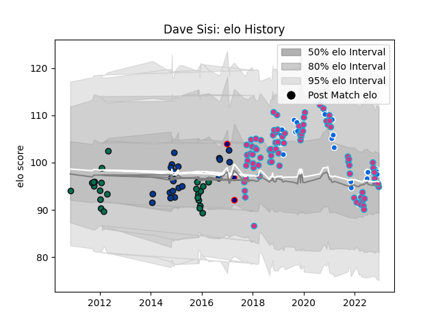

---  
layout: page  
title: Dave Sisi  
date: 2022-11-22 11:38:54.417726  
categories: player  
---
# Dave Sisi

## Positions: L, FL

## Country: Italy

## Current elo: 98.0

## Current Percentile: 64.0

# Elo History

# Match History

| Team            |   Appearances |   Win Rate |
|:----------------|--------------:|-----------:|
| Zebre           |            78 |   0.269231 |
| Italy           |            26 |   0.269231 |
| London Irish    |            24 |   0.416667 |
| Bath Rugby      |            21 |   0.690476 |
| London Scottish |             3 |   0.333333 |

| Opponent             |   Matches |   Win Rate |
|:---------------------|----------:|-----------:|
| Benetton Treviso     |        12 |   0.333333 |
| Edinburgh            |         9 |   0.222222 |
| Glasgow Warriors     |         7 |   0        |
| Cardiff Blues        |         6 |   0.333333 |
| Connacht             |         6 |   0.333333 |
| Harlequins           |         5 |   0.4      |
| Ospreys              |         5 |   0.2      |
| England              |         4 |   0        |
| Ireland              |         4 |   0        |
| Dragons              |         4 |   0.5      |
| Agen                 |         4 |   0.75     |
| Leinster             |         4 |   0        |
| Munster              |         4 |   0        |
| Newcastle Falcons    |         4 |   0.75     |
| Bristol Rugby        |         4 |   0.375    |
| Scarlets             |         4 |   0        |
| Gloucester Rugby     |         4 |   0.625    |
| Wales                |         3 |   0.333333 |
| Worcester Warriors   |         3 |   1        |
| Cheetahs             |         3 |   0.333333 |
| London Welsh         |         2 |   1        |
| Sale Sharks          |         2 |   0.5      |
| Saracens             |         2 |   0.5      |
| RC Enisei            |         2 |   1        |
| France               |         2 |   0        |
| Pau                  |         2 |   0        |
| Scotland             |         2 |   0        |
| Northampton Saints   |         2 |   1        |
| South Africa         |         2 |   0        |
| Southern Kings       |         2 |   1        |
| Montpellier Herault  |         2 |   1        |
| Leicester Tigers     |         2 |   0.5      |
| Ulster               |         2 |   0.5      |
| Wasps                |         2 |   0        |
| Grenoble             |         2 |   0        |
| Stade Francais Paris |         1 |   0        |
| Stade Toulousain     |         1 |   0        |
| Sharks               |         1 |   0        |
| Stormers             |         1 |   0        |
| Bath Rugby           |         1 |   0        |
| Australia            |         1 |   1        |
| Samoa                |         1 |   1        |
| Georgia              |         1 |   0        |
| Russia               |         1 |   1        |
| Rotherham Titans     |         1 |   1        |
| Romania              |         1 |   1        |
| Bayonne              |         1 |   0.5      |
| Nottingham           |         1 |   0        |
| Brive                |         1 |   1        |
| New Zealand          |         1 |   0        |
| Canada               |         1 |   1        |
| Argentina            |         1 |   0        |
| London Irish         |         1 |   1        |
| Lions                |         1 |   0        |
| La Rochelle          |         1 |   0        |
| Ealing Trailfinders  |         1 |   0        |
| Exeter Chiefs        |         1 |   0        |
| Portugal             |         1 |   1        |