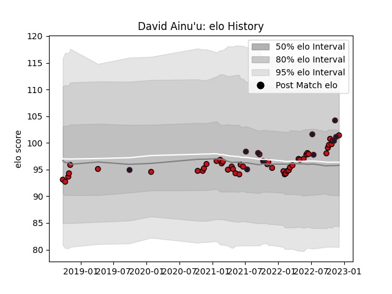

---  
layout: page  
title: David Ainu'u  
date: 2023-01-13 11:24:28.518998  
categories: player  
---
# David Ainu'u

## Positions: P

## Country: United States of America

## Current elo: 102.0

## Current Percentile: 71.0

# Elo History

# Match History

| Team                     |   Appearances |   Win Rate |
|:-------------------------|--------------:|-----------:|
| Stade Toulousain         |            47 |   0.648936 |
| United States of America |            12 |   0.541667 |

| Opponent             |   Matches |   Win Rate |
|:---------------------|----------:|-----------:|
| La Rochelle          |         5 |   0.8      |
| Montpellier Herault  |         5 |   0.6      |
| Bordeaux Begles      |         5 |   1        |
| Racing 92            |         5 |   0.6      |
| Perpignan            |         4 |   0.75     |
| Toulon               |         3 |   0        |
| Pau                  |         3 |   0.666667 |
| Agen                 |         3 |   1        |
| Castres Olympique    |         3 |   0.166667 |
| Brive                |         3 |   1        |
| Chile                |         2 |   0.5      |
| Stade Francais Paris |         2 |   0        |
| England              |         2 |   0        |
| Clermont Auvergne    |         2 |   1        |
| Leinster             |         1 |   1        |
| Lyon                 |         1 |   0        |
| Bayonne              |         1 |   0        |
| Kenya                |         1 |   1        |
| Canada               |         1 |   1        |
| Portugal             |         1 |   0.5      |
| Ireland              |         1 |   0        |
| Romania              |         1 |   1        |
| Samoa                |         1 |   1        |
| Hong Kong            |         1 |   1        |
| Biarritz Olympique   |         1 |   1        |
| Uruguay              |         1 |   0        |