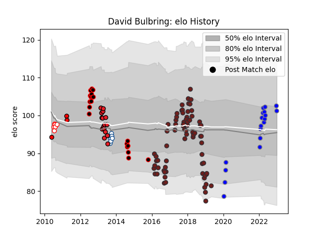

---  
layout: page  
title: David Bulbring  
date: 2022-12-28 12:55:45.826317  
categories: player  
---
# David Bulbring

## Positions: L

## Current elo: 101.0

## Current Percentile: 75.0

# Elo History

# Match History

| Team                              |   Appearances |   Win Rate |
|:----------------------------------|--------------:|-----------:|
| Scarlets                          |            73 |   0.582192 |
| Eastern Province Kings            |            19 |   0.578947 |
| Kubota Spears Funabashi Tokyo-Bay |            18 |   0.694444 |
| Southern Kings                    |            16 |   0.21875  |
| Blue Bulls                        |             6 |   0.333333 |
| Golden Lions                      |             6 |   0.333333 |
| Lions                             |             3 |   0        |

| Opponent                        |   Matches |   Win Rate |
|:--------------------------------|----------:|-----------:|
| Ulster                          |         8 |   0.375    |
| Dragons                         |         7 |   0.857143 |
| Benetton Treviso                |         7 |   0.857143 |
| Leinster                        |         7 |   0.357143 |
| Ospreys                         |         6 |   0.833333 |
| Edinburgh                       |         6 |   0.333333 |
| Cardiff Blues                   |         5 |   0.6      |
| Western Province                |         5 |   0        |
| Southern Kings                  |         4 |   1        |
| Cheetahs                        |         4 |   0        |
| Munster                         |         4 |   0.25     |
| Connacht                        |         4 |   0.75     |
| Blue Bulls                      |         3 |   0        |
| Griquas                         |         3 |   0.666667 |
| Natal Sharks                    |         3 |   0        |
| Yokohama Canon Eagles           |         3 |   0.5      |
| Bulls                           |         3 |   0        |
| Pumas                           |         2 |   0.5      |
| Stormers                        |         2 |   0        |
| Leicester Tigers                |         2 |   0.5      |
| Racing 92                       |         2 |   0        |
| SWD Eagles                      |         2 |   1        |
| Saitama Wild Knights            |         2 |   0        |
| Leopards                        |         2 |   1        |
| Bath Rugby                      |         2 |   0.5      |
| Urayasu D-Rocks                 |         2 |   1        |
| Toulon                          |         2 |   0.5      |
| Kobelco Kobe Steelers           |         2 |   0.5      |
| Toyota Verblitz                 |         2 |   0.5      |
| Griffons                        |         2 |   1        |
| Green Rockets Tokatsu           |         2 |   1        |
| Golden Lions                    |         2 |   0        |
| Glasgow Warriors                |         2 |   0.5      |
| Free State Cheetahs             |         2 |   0.5      |
| Valke                           |         2 |   1        |
| Boland Cavaliers                |         2 |   1        |
| Sharks                          |         2 |   0        |
| Toshiba Brave Lupus Tokyo       |         1 |   1        |
| Saracens                        |         1 |   0        |
| Tokyo Sungoliath                |         1 |   1        |
| Western Force                   |         1 |   1        |
| Melbourne Rebels                |         1 |   1        |
| Sale Sharks                     |         1 |   1        |
| Queensland Reds                 |         1 |   0        |
| New South Wales Waratahs        |         1 |   0        |
| NTT Docomo Red Hurricanes Osaka |         1 |   1        |
| Munakata Sanix Blues            |         1 |   1        |
| La Rochelle                     |         1 |   1        |
| Hurricanes                      |         1 |   0        |
| Hino Red Dolphins               |         1 |   1        |
| Highlanders                     |         1 |   1        |
| Crusaders                       |         1 |   0        |
| Chiefs                          |         1 |   0        |
| Brumbies                        |         1 |   0.5      |
| Border Bulldogs                 |         1 |   1        |
| Zebre                           |         1 |   1        |