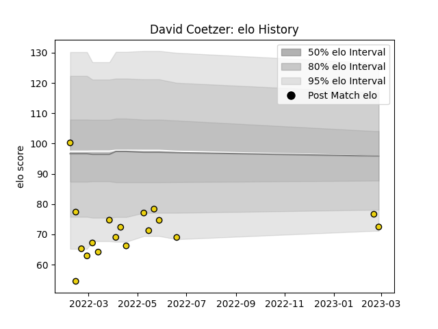

---  
layout: page  
title: David Coetzer  
date: 2023-03-02 11:21:49.963211  
categories: player  
---
# David Coetzer

## Positions: FH

## Current elo: 72.0

## Current Percentile: 8.0

# Elo History

# Match History

| Team              |   Appearances |   Win Rate |
|:------------------|--------------:|-----------:|
| Houston SaberCats |            18 |   0.555556 |

| Opponent          |   Matches |   Win Rate |
|:------------------|----------:|-----------:|
| Dallas Jackals    |         3 |   1        |
| Seattle Seawolves |         3 |   0.333333 |
| L. A. Giltinis    |         2 |   0.5      |
| San Diego Legion  |         2 |   0.5      |
| Utah Warriors     |         2 |   1        |
| Austin Gilgronis  |         1 |   0        |
| NOLA Gold         |         1 |   1        |
| Old Glory DC      |         1 |   1        |
| R.U. New York     |         1 |   0        |
| Rugby ATL         |         1 |   0        |
| Rugby New York    |         1 |   0        |