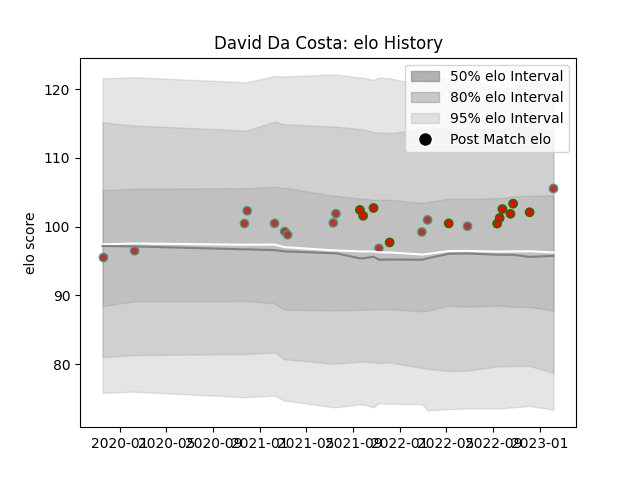

---  
layout: page  
title: David Da Costa  
date: 2023-02-05 15:10:03.854267  
categories: player  
---
# David Da Costa

## Positions: P

## Country: Portugal

## Current elo: 106.0

## Current Percentile: 69.0

# Elo History

# Match History

| Team         |   Appearances |   Win Rate |
|:-------------|--------------:|-----------:|
| Portugal     |            14 |   0.642857 |
| Lusitanos XV |            11 |   0.727273 |

| Opponent                 |   Matches |   Win Rate |
|:-------------------------|----------:|-----------:|
| Castilla y Leon Iberians |         4 |       0.75 |
| Brussels Devils          |         3 |       1    |
| Brazil                   |         2 |       1    |
| Delta                    |         2 |       1    |
| Netherlands              |         2 |       1    |
| Romania                  |         2 |       0.5  |
| Spain                    |         2 |       0    |
| Belgium                  |         1 |       1    |
| Black Lion               |         1 |       0    |
| Canada                   |         1 |       1    |
| Chile                    |         1 |       1    |
| Georgia                  |         1 |       0    |
| Italy                    |         1 |       0    |
| Russia                   |         1 |       1    |
| Tel-Aviv Heat            |         1 |       0    |