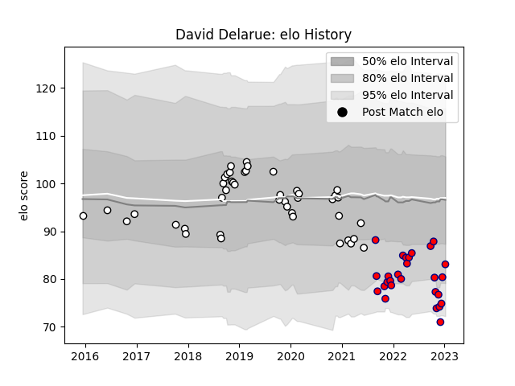

---  
layout: page  
title: David Delarue  
date: 2022-12-14 11:20:26.670946  
categories: player  
---
# David Delarue

## Positions: SH

## Current elo: 84.0

## Current Percentile: 6.0

# Elo History

# Match History

| Team     |   Appearances |   Win Rate |
|:---------|--------------:|-----------:|
| Brive    |            31 |   0.33871  |
| Aurillac |            14 |   0.357143 |

| Opponent             |   Matches |   Win Rate |
|:---------------------|----------:|-----------:|
| Agen                 |         3 |   0.666667 |
| Colomiers            |         2 |   0.5      |
| Racing 92            |         2 |   0        |
| RC Enisei            |         2 |   0.5      |
| Lyon                 |         2 |   0.5      |
| La Rochelle          |         2 |   0        |
| Connacht             |         2 |   0        |
| Montpellier Herault  |         2 |   0        |
| Carcassonne          |         2 |   0        |
| Biarritz Olympique   |         2 |   0.25     |
| Bayonne              |         2 |   0        |
| Beziers              |         2 |   1        |
| Zebre                |         2 |   0        |
| Bristol Rugby        |         2 |   0        |
| Soyaux-Angouleme     |         1 |   1        |
| Worcester Warriors   |         1 |   1        |
| Vannes               |         1 |   1        |
| US Bressane          |         1 |   0        |
| Toulon               |         1 |   0        |
| Stade Toulousain     |         1 |   0        |
| Stade Francais Paris |         1 |   1        |
| Mont-de-Marsan       |         1 |   0        |
| Montauban            |         1 |   1        |
| Leicester Tigers     |         1 |   0        |
| Grenoble             |         1 |   0        |
| Pau                  |         1 |   1        |
| Oyonnax              |         1 |   0        |
| Nevers               |         1 |   1        |
| Aurillac             |         1 |   1        |
| Provence Rugby       |         1 |   0        |