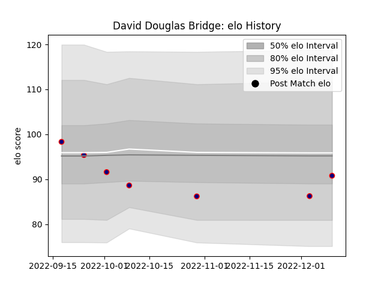

---  
layout: page  
title: David Douglas Bridge  
date: 2022-12-18 16:25:11.691440  
categories: player  
---
# David Douglas Bridge

## Positions: L, FL

## Current elo: 91.0

## Current Percentile: 17.0

# Elo History

# Match History

| Team            |   Appearances |   Win Rate |
|:----------------|--------------:|-----------:|
| London Scottish |             7 |   0.142857 |

| Opponent        |   Matches |   Win Rate |
|:----------------|----------:|-----------:|
| Ampthill        |         1 |          0 |
| Bedford         |         1 |          0 |
| Caldy           |         1 |          1 |
| Cornish Pirates |         1 |          0 |
| Coventry        |         1 |          0 |
| Doncaster       |         1 |          0 |
| Jersey          |         1 |          0 |