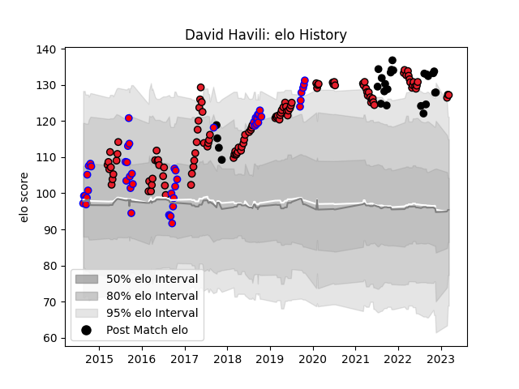

---  
layout: page  
title: David Havili  
date: 2023-03-17 17:42:16.718704  
categories: player  
---
# David Havili

## Positions: C, FB

## Country: New Zealand

## Current elo: 127.0

## Current Percentile: 96.0

# Elo History

# Match History

| Team        |   Appearances |   Win Rate |
|:------------|--------------:|-----------:|
| Crusaders   |           114 |   0.79386  |
| Tasman      |            50 |   0.76     |
| New Zealand |            26 |   0.711538 |

| Opponent                 |   Matches |   Win Rate |
|:-------------------------|----------:|-----------:|
| Chiefs                   |        18 |   0.555556 |
| Hurricanes               |        16 |   0.75     |
| Highlanders              |        15 |   0.733333 |
| Blues                    |        14 |   0.928571 |
| Auckland                 |         7 |   0.5      |
| Brumbies                 |         7 |   1        |
| Canterbury               |         7 |   0.428571 |
| Lions                    |         7 |   0.857143 |
| New South Wales Waratahs |         6 |   0.666667 |
| Melbourne Rebels         |         5 |   1        |
| Australia                |         5 |   0.8      |
| Waikato                  |         5 |   1        |
| Taranaki                 |         5 |   0.6      |
| South Africa             |         5 |   0.6      |
| Queensland Reds          |         5 |   1        |
| North Harbour            |         4 |   0.875    |
| Argentina                |         4 |   0.75     |
| Otago                    |         4 |   0.75     |
| Bulls                    |         4 |   0.75     |
| Wellington               |         4 |   1        |
| Sharks                   |         3 |   1        |
| Southland                |         3 |   1        |
| Stormers                 |         3 |   0.833333 |
| Western Force            |         3 |   1        |
| Counties Manukau         |         3 |   0.666667 |
| Hawke's Bay              |         3 |   1        |
| Manawatu                 |         2 |   1        |
| Bay of Plenty            |         2 |   1        |
| Wales                    |         2 |   1        |
| Cheetahs                 |         2 |   1        |
| Fiji                     |         2 |   1        |
| France                   |         2 |   0.5      |
| Ireland                  |         2 |   0        |
| Jaguares                 |         2 |   1        |
| Scotland                 |         1 |   1        |
| Fijian Drua              |         1 |   0        |
| Japan                    |         1 |   1        |
| Southern Kings           |         1 |   1        |
| England                  |         1 |   0.5      |
| Sunwolves                |         1 |   1        |
| Northland                |         1 |   1        |
| British and Irish Lions  |         1 |   0        |
| Italy                    |         1 |   1        |