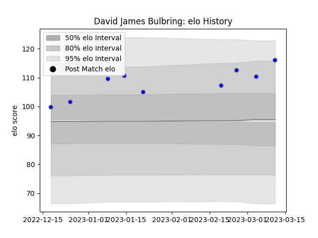

---  
layout: page  
title: David James Bulbring  
date: 2023-03-21 18:56:52.805535  
categories: player  
---
# David James Bulbring

Last updated: 2023-03-21
## Positions: L

## Current elo: 104.0

## Current Percentile: 93.0

# Elo History

# Match History

| Team                              |   Appearances |   Win Rate |
|:----------------------------------|--------------:|-----------:|
| Kubota Spears Funabashi Tokyo-Bay |            10 |       0.85 |

| Opponent                  |   Matches |   Win Rate |
|:--------------------------|----------:|-----------:|
| Yokohama Canon Eagles     |         3 |   0.833333 |
| Green Rockets Tokatsu     |         1 |   1        |
| Hanazono Kintetsu Liners  |         1 |   1        |
| Kobelco Kobe Steelers     |         1 |   1        |
| Mitsubishi Dynaboars      |         1 |   1        |
| Saitama Wild Knights      |         1 |   0        |
| Shizuoka Blue Revs        |         1 |   1        |
| Toshiba Brave Lupus Tokyo |         1 |   1        |