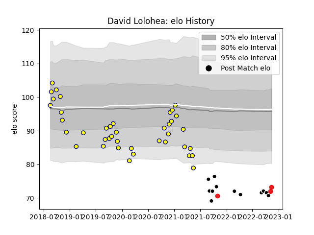

---  
layout: page  
title: David Lolohea  
date: 2022-11-15 23:44:00.574223  
categories: player  
---
# David Lolohea

## Positions: P

## Country: Tonga

## Current elo: 73.0

## Current Percentile: 1.0

# Elo History

# Match History

| Team           |   Appearances |   Win Rate |
|:---------------|--------------:|-----------:|
| Nevers         |            40 |   0.5375   |
| Provence Rugby |            12 |   0.375    |
| Tonga          |             3 |   0.666667 |

| Opponent                   |   Matches |   Win Rate |
|:---------------------------|----------:|-----------:|
| Carcassonne                |         6 |   0.5      |
| Oyonnax                    |         5 |   0.3      |
| Vannes                     |         4 |   0.5      |
| Biarritz Olympique         |         4 |   0.75     |
| Soyaux-Angouleme           |         4 |   0.625    |
| Rouen                      |         4 |   0.5      |
| Provence Rugby             |         3 |   0.666667 |
| Beziers                    |         3 |   1        |
| Colomiers                  |         3 |   0        |
| Nevers                     |         3 |   0.333333 |
| Montauban                  |         2 |   1        |
| Perpignan                  |         2 |   0.5      |
| Valence Romans Drome Rugby |         1 |   0        |
| US Bressane                |         1 |   1        |
| Spain                      |         1 |   1        |
| Scotland                   |         1 |   0        |
| Aurillac                   |         1 |   0        |
| Bayonne                    |         1 |   0        |
| Mont-de-Marsan             |         1 |   1        |
| Massy                      |         1 |   1        |
| Grenoble                   |         1 |   0        |
| Chile                      |         1 |   1        |
| Brive                      |         1 |   0        |
| Narbonne                   |         1 |   0        |