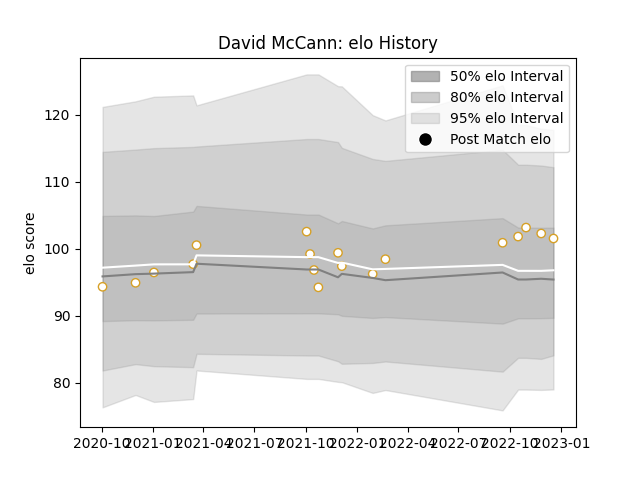

---  
layout: page  
title: David McCann  
date: 2023-01-15 12:02:32.324670  
categories: player  
---
# David McCann

## Positions: N8, FL

## Current elo: 104.0

## Current Percentile: 68.0

# Elo History

# Match History

| Team   |   Appearances |   Win Rate |
|:-------|--------------:|-----------:|
| Ulster |            20 |        0.8 |

| Opponent         |   Matches |   Win Rate |
|:-----------------|----------:|-----------:|
| Connacht         |         3 |   0.666667 |
| Zebre            |         3 |   1        |
| Benetton Treviso |         2 |   1        |
| Dragons          |         2 |   1        |
| La Rochelle      |         2 |   0        |
| Lions            |         2 |   1        |
| Munster          |         2 |   1        |
| Edinburgh        |         1 |   1        |
| Leinster         |         1 |   1        |
| Ospreys          |         1 |   0        |
| Scarlets         |         1 |   1        |