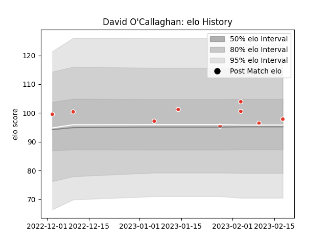

---  
layout: page  
title: David O'Callaghan  
date: 2023-02-24 02:32:04.902708  
categories: player  
---
# David O'Callaghan

## Positions: FL, L

## Current elo: 98.0

## Current Percentile: 52.0

# Elo History

# Match History

| Team               |   Appearances |   Win Rate |
|:-------------------|--------------:|-----------:|
| Biarritz Olympique |             9 |   0.611111 |

| Opponent         |   Matches |   Win Rate |
|:-----------------|----------:|-----------:|
| Vannes           |         2 |        1   |
| Agen             |         1 |        0   |
| Colomiers        |         1 |        0   |
| Grenoble         |         1 |        0.5 |
| Montauban        |         1 |        1   |
| Oyonnax          |         1 |        0   |
| Rouen            |         1 |        1   |
| Soyaux-Angouleme |         1 |        1   |