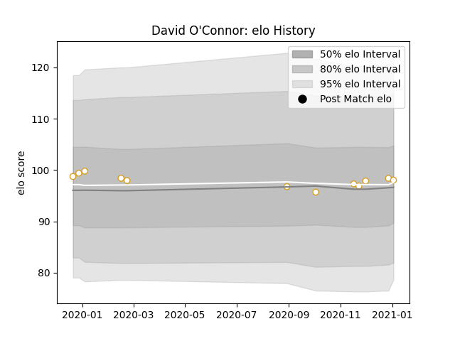

---  
layout: page  
title: David O'Connor  
date: 2022-12-31 16:29:52.305662  
categories: player  
---
# David O'Connor

## Positions: L

## Current elo: 98.0

## Current Percentile: None

# Elo History

# Match History

| Team   |   Appearances |   Win Rate |
|:-------|--------------:|-----------:|
| Ulster |            12 |       0.75 |

| Opponent         |   Matches |   Win Rate |
|:-----------------|----------:|-----------:|
| Connacht         |         2 |          1 |
| Leinster         |         2 |          0 |
| Munster          |         2 |          1 |
| Benetton Treviso |         1 |          1 |
| Cheetahs         |         1 |          1 |
| Edinburgh        |         1 |          1 |
| Ospreys          |         1 |          0 |
| Scarlets         |         1 |          1 |
| Zebre            |         1 |          1 |