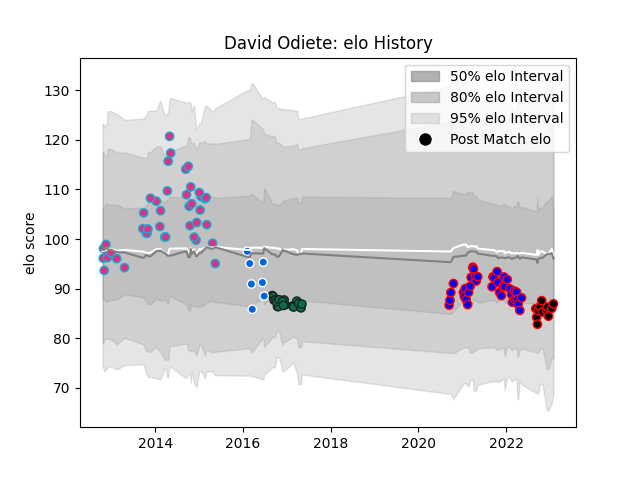

---  
layout: page  
title: David Odiete  
date: 2022-12-14 11:31:19.370127  
categories: player  
---
# David Odiete

## Positions: W, FB

## Country: Italy

## Current elo: 97.0

## Current Percentile: 57.0

# Elo History

# Match History

| Team             |   Appearances |   Win Rate |
|:-----------------|--------------:|-----------:|
| Zebre            |            42 |   0.166667 |
| Dijon            |            37 |   0.378378 |
| Benetton Treviso |            18 |   0.277778 |
| Nice             |             9 |   0.5      |
| Italy            |             7 |   0.285714 |

| Opponent                   |   Matches |   Win Rate |
|:---------------------------|----------:|-----------:|
| Leinster                   |         7 |   0        |
| Munster                    |         6 |   0        |
| Scarlets                   |         5 |   0.1      |
| Ospreys                    |         5 |   0.4      |
| Connacht                   |         5 |   0        |
| Chambery                   |         4 |   0.5      |
| Suresnes                   |         4 |   0.5      |
| Glasgow Warriors           |         4 |   0        |
| Ulster                     |         4 |   0        |
| Edinburgh                  |         4 |   0.25     |
| Dax                        |         4 |   0.25     |
| Albi                       |         4 |   0.125    |
| Cardiff Blues              |         4 |   0.25     |
| Bourgoin-Jallieu           |         4 |   0.25     |
| Tarbes                     |         3 |   0.833333 |
| Blagnac                    |         3 |   0.666667 |
| Cognac Saint Jean d'Angély |         3 |   0        |
| US Bressane                |         3 |   0        |
| Gloucester Rugby           |         3 |   0        |
| Dragons                    |         3 |   0.833333 |
| Brive                      |         2 |   1        |
| Valence Romans Drome Rugby |         2 |   0.5      |
| Massy                      |         2 |   0.5      |
| Benetton Treviso           |         2 |   0        |
| Narbonne                   |         2 |   0        |
| Nice                       |         2 |   0.5      |
| Bayonne                    |         2 |   1        |
| Aubenas                    |         2 |   0.75     |
| Soyaux-Angouleme           |         2 |   0.5      |
| Scotland                   |         1 |   0        |
| Wales                      |         1 |   0        |
| United States of America   |         1 |   1        |
| Ireland                    |         1 |   0        |
| Rennes                     |         1 |   1        |
| Oyonnax                    |         1 |   0        |
| La Rochelle                |         1 |   0        |
| Argentina                  |         1 |   0        |
| France                     |         1 |   0        |
| Carqueiranne-Hyères        |         1 |   1        |
| Canada                     |         1 |   1        |
| Biarritz Olympique         |         1 |   0        |
| Zebre                      |         1 |   1        |