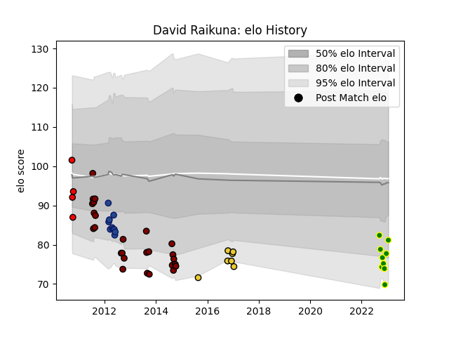

---  
layout: page  
title: David Raikuna  
date: 2022-11-15 23:36:52.510339  
categories: player  
---
# David Raikuna

## Positions: W

## Current elo: 76.0

## Current Percentile: 4.0

# Elo History

# Match History

| Team                |   Appearances |   Win Rate |
|:--------------------|--------------:|-----------:|
| North Harbour       |            25 |   0.14     |
| Blues               |            10 |   0.2      |
| La Rochelle         |             7 |   0.714286 |
| Carqueiranne-Hyères |             5 |   0.2      |
| Counties Manukau    |             4 |   0.5      |

| Opponent                   |   Matches |   Win Rate |
|:---------------------------|----------:|-----------:|
| Auckland                   |         4 |      0     |
| Northland                  |         4 |      0.625 |
| Bayonne                    |         3 |      1     |
| Southland                  |         3 |      0     |
| Otago                      |         3 |      0     |
| Crusaders                  |         2 |      0     |
| Waikato                    |         2 |      0     |
| Manawatu                   |         2 |      0.5   |
| Hurricanes                 |         2 |      0     |
| Highlanders                |         2 |      0     |
| Bay of Plenty              |         2 |      0     |
| Hawke's Bay                |         2 |      0     |
| Wellington                 |         2 |      0     |
| Counties Manukau           |         2 |      0     |
| Chiefs                     |         2 |      0     |
| Blagnac                    |         1 |      0     |
| Benetton Treviso           |         1 |      1     |
| Valence Romans Drome Rugby |         1 |      0     |
| US Bressane                |         1 |      0     |
| Tasman                     |         1 |      1     |
| Suresnes                   |         1 |      0     |
| Gloucester Rugby           |         1 |      0     |
| Bulls                      |         1 |      1     |
| Grenoble                   |         1 |      1     |
| North Harbour              |         1 |      1     |
| Chambery                   |         1 |      1     |
| Lions                      |         1 |      1     |
| Clermont Auvergne          |         1 |      0     |
| Canterbury                 |         1 |      0     |