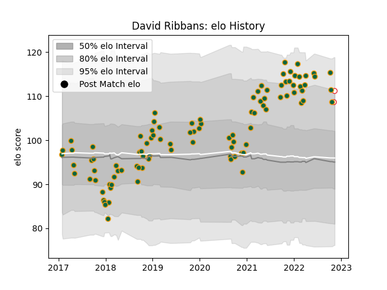

---  
layout: page  
title: David Ribbans  
date: 2022-12-18 16:39:45.065619  
categories: player  
---
# David Ribbans

## Positions: L

## Country: England

## Current elo: 105.0

## Current Percentile: 83.0

# Elo History

# Match History

| Team               |   Appearances |   Win Rate |
|:-------------------|--------------:|-----------:|
| Northampton Saints |           101 |   0.445545 |
| England            |             4 |   0.375    |

| Opponent           |   Matches |   Win Rate |
|:-------------------|----------:|-----------:|
| Exeter Chiefs      |        11 |   0.272727 |
| Wasps              |        10 |   0.6      |
| Bath Rugby         |        10 |   0.3      |
| Saracens           |         9 |   0.111111 |
| Harlequins         |         9 |   0.555556 |
| Gloucester Rugby   |         8 |   0.375    |
| Leicester Tigers   |         7 |   0.142857 |
| Worcester Warriors |         6 |   1        |
| Newcastle Falcons  |         6 |   0.5      |
| Sale Sharks        |         5 |   0.2      |
| London Irish       |         4 |   1        |
| Bristol Rugby      |         4 |   0.75     |
| Dragons            |         2 |   1        |
| Ospreys            |         2 |   0        |
| Clermont Auvergne  |         2 |   0        |
| La Rochelle        |         1 |   0        |
| Japan              |         1 |   1        |
| Lyon               |         1 |   1        |
| Munster            |         1 |   0        |
| New Zealand        |         1 |   0.5      |
| Scarlets           |         1 |   1        |
| South Africa       |         1 |   0        |
| Timisoara Saracens |         1 |   1        |
| Benetton Treviso   |         1 |   1        |
| Argentina          |         1 |   0        |