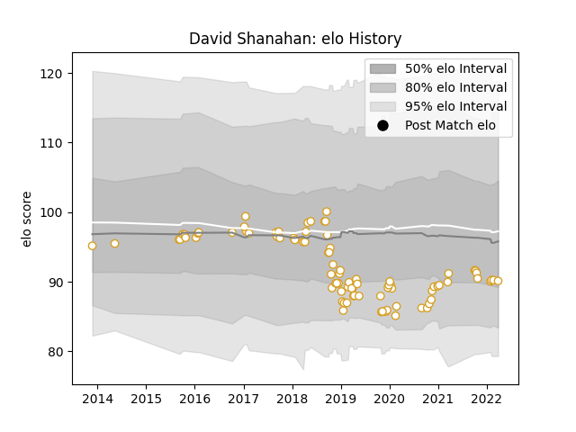

---  
layout: page  
title: David Shanahan  
date: 2022-12-14 11:24:15.347904  
categories: player  
---
# David Shanahan

## Positions: SH

## Current elo: 90.0

## Current Percentile: None

# Elo History

# Match History

| Team   |   Appearances |   Win Rate |
|:-------|--------------:|-----------:|
| Ulster |            88 |     0.6875 |

| Opponent          |   Matches |   Win Rate |
|:------------------|----------:|-----------:|
| Connacht          |         8 |   0.5      |
| Scarlets          |         7 |   0.571429 |
| Edinburgh         |         7 |   0.857143 |
| Zebre             |         6 |   0.833333 |
| Munster           |         6 |   0.583333 |
| Dragons           |         6 |   1        |
| Benetton Treviso  |         6 |   0.916667 |
| Ospreys           |         6 |   0.833333 |
| Leinster          |         6 |   0.166667 |
| Cardiff Blues     |         4 |   0.75     |
| Cheetahs          |         3 |   0.833333 |
| Glasgow Warriors  |         3 |   0.333333 |
| Southern Kings    |         2 |   1        |
| Racing 92         |         2 |   0.5      |
| Oyonnax           |         2 |   1        |
| Bath Rugby        |         2 |   1        |
| Leicester Tigers  |         2 |   1        |
| Harlequins        |         2 |   1        |
| Clermont Auvergne |         2 |   0.5      |
| Lions             |         1 |   1        |
| Exeter Chiefs     |         1 |   0        |
| Bordeaux Begles   |         1 |   0        |
| Stormers          |         1 |   0        |
| Wasps             |         1 |   0        |
| La Rochelle       |         1 |   1        |