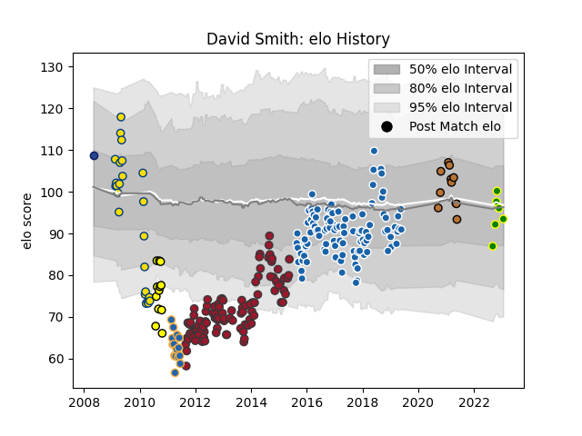

---  
layout: page  
title: David Smith  
date: 2023-01-23 15:29:12.065392  
categories: player  
---
# David Smith

## Positions: W

## Current elo: 93.0

## Current Percentile: 49.0

# Elo History

# Match History

| Team                |   Appearances |   Win Rate |
|:--------------------|--------------:|-----------:|
| Castres Olympique   |           106 |   0.542453 |
| Toulon              |           101 |   0.707921 |
| Hurricanes          |            24 |   0.583333 |
| Western Force       |            15 |   0.333333 |
| Taranaki            |            12 |   0.666667 |
| Narbonne            |            11 |   0.727273 |
| Carqueiranne-Hyères |             6 |   0.5      |
| Blues               |             1 |   1        |

| Opponent                   |   Matches |   Win Rate |
|:---------------------------|----------:|-----------:|
| Stade Toulousain           |        16 |   0.5      |
| Montpellier Herault        |        16 |   0.59375  |
| Stade Francais Paris       |        14 |   0.535714 |
| Racing 92                  |        14 |   0.642857 |
| Bordeaux Begles            |        13 |   0.769231 |
| Clermont Auvergne          |        13 |   0.461538 |
| Lyon                       |        11 |   0.818182 |
| Agen                       |        10 |   0.7      |
| Grenoble                   |        10 |   0.5      |
| Brive                      |         8 |   0.5      |
| Toulon                     |         8 |   0.375    |
| La Rochelle                |         8 |   0.5      |
| Bayonne                    |         8 |   0.875    |
| Pau                        |         7 |   0.571429 |
| Castres Olympique          |         7 |   0.571429 |
| Oyonnax                    |         7 |   0.857143 |
| Biarritz Olympique         |         6 |   0.666667 |
| Perpignan                  |         6 |   1        |
| Queensland Reds            |         5 |   0.6      |
| New South Wales Waratahs   |         4 |   0        |
| Brumbies                   |         4 |   0.875    |
| Sale Sharks                |         3 |   0.666667 |
| Sharks                     |         3 |   0        |
| Stormers                   |         3 |   0.333333 |
| Cardiff Blues              |         3 |   1        |
| Munster                    |         3 |   0.5      |
| Blues                      |         3 |   0.833333 |
| Highlanders                |         3 |   1        |
| Leinster                   |         3 |   0.5      |
| Albi                       |         2 |   0        |
| Northampton Saints         |         2 |   0.5      |
| Tarbes                     |         2 |   1        |
| Melbourne Rebels           |         2 |   0.5      |
| Bulls                      |         2 |   0        |
| Lions                      |         2 |   1        |
| Western Force              |         2 |   1        |
| Cognac Saint Jean d'Angély |         2 |   1        |
| Glasgow Warriors           |         2 |   1        |
| Bourgoin-Jallieu           |         2 |   0.5      |
| Crusaders                  |         2 |   0.5      |
| Dijon                      |         2 |   0.5      |
| Cheetahs                   |         2 |   0.5      |
| Exeter Chiefs              |         2 |   0.5      |
| Chiefs                     |         2 |   0        |
| Aubenas                    |         1 |   1        |
| Tasman                     |         1 |   1        |
| US Bressane                |         1 |   0        |
| Suresnes                   |         1 |   1        |
| Ulster                     |         1 |   1        |
| Chambery                   |         1 |   1        |
| Auckland                   |         1 |   0        |
| Waikato                    |         1 |   1        |
| Bay of Plenty              |         1 |   1        |
| Southland                  |         1 |   1        |
| Wellington                 |         1 |   0        |
| Canterbury                 |         1 |   1        |
| Leicester Tigers           |         1 |   0        |
| Scarlets                   |         1 |   1        |
| Hurricanes                 |         1 |   0        |
| Counties Manukau           |         1 |   1        |
| Dax                        |         1 |   0        |
| Northland                  |         1 |   0        |
| North Harbour              |         1 |   1        |
| Newcastle Falcons          |         1 |   1        |
| Dragons                    |         1 |   0        |
| Gloucester Rugby           |         1 |   0        |
| Harlequins                 |         1 |   1        |
| Manawatu                   |         1 |   1        |
| Blagnac                    |         1 |   1        |
| Hawke's Bay                |         1 |   0        |
| Massy                      |         1 |   1        |