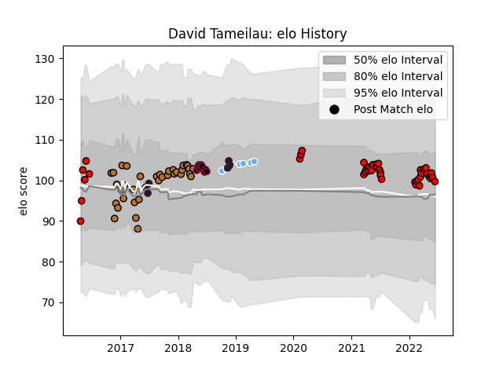

---  
layout: page  
title: David Tameilau  
date: 2023-03-21 18:55:21.991793  
categories: player  
---
# David Tameilau

Last updated: 2023-03-21
## Positions: N8

## Country: United States of America

## Current elo: 100.0

## Current Percentile: 62.0

# Elo History

# Match History

| Team                     |   Appearances |   Win Rate |
|:-------------------------|--------------:|-----------:|
| San Diego Legion         |            37 |   0.432432 |
| Narbonne                 |            35 |   0.385714 |
| Utah Warriors            |             9 |   0.333333 |
| Glasgow Warriors         |             7 |   1        |
| San Francisco            |             6 |   0.333333 |
| United States of America |             6 |   0.583333 |

| Opponent               |   Matches |   Win Rate |
|:-----------------------|----------:|-----------:|
| Seattle Seawolves      |         8 |   0.375    |
| Houston SaberCats      |         5 |   0.6      |
| Austin Gilgronis       |         4 |   0.25     |
| Utah Warriors          |         4 |   0.75     |
| Carcassonne            |         4 |   0.5      |
| L. A. Giltinis         |         4 |   0.25     |
| Dax                    |         4 |   0.5      |
| Montauban              |         3 |   0.333333 |
| Perpignan              |         3 |   0        |
| Vannes                 |         3 |   0.333333 |
| Beziers                |         3 |   0.333333 |
| NOLA Gold              |         3 |   0.666667 |
| Soyaux-Angouleme       |         3 |   0.333333 |
| San Diego              |         2 |   0.5      |
| Old Glory DC           |         2 |   0.5      |
| New England Free Jacks |         2 |   0.5      |
| Ohio                   |         2 |   0.5      |
| Ospreys                |         2 |   1        |
| Rugby New York         |         2 |   0        |
| Massy                  |         2 |   0.5      |
| Glendale Raptors       |         2 |   0        |
| Ireland                |         2 |   0        |
| Rugby ATL              |         2 |   0        |
| Denver                 |         2 |   0        |
| Colomiers              |         2 |   0.25     |
| Canada                 |         2 |   0.75     |
| Austin Elite Rugby     |         2 |   0.5      |
| R.U. New York          |         2 |   0        |
| San Diego Legion       |         1 |   0        |
| Scarlets               |         1 |   1        |
| Samoa                  |         1 |   1        |
| Toronto Arrows         |         1 |   1        |
| Ulster                 |         1 |   1        |
| Agen                   |         1 |   1        |
| Romania                |         1 |   1        |
| Oyonnax                |         1 |   1        |
| Nevers                 |         1 |   0        |
| Albi                   |         1 |   0.5      |
| Mont-de-Marsan         |         1 |   0        |
| Grenoble               |         1 |   0.5      |
| Edinburgh              |         1 |   1        |
| Dallas Jackals         |         1 |   1        |
| Colorado Raptors       |         1 |   1        |
| Cardiff Blues          |         1 |   1        |
| Bourgoin-Jallieu       |         1 |   1        |
| Bayonne                |         1 |   0        |
| Zebre                  |         1 |   1        |