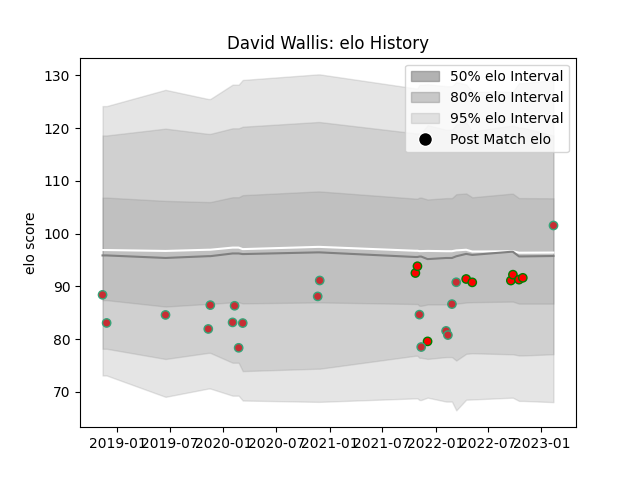

---  
layout: page  
title: David Wallis  
date: 2023-02-16 11:19:52.649375  
categories: player  
---
# David Wallis

## Positions: FL

## Country: Portugal

## Current elo: 101.0

## Current Percentile: 41.0

# Elo History

# Match History

| Team         |   Appearances |   Win Rate |
|:-------------|--------------:|-----------:|
| Portugal     |            18 |   0.527778 |
| Lusitanos XV |             9 |   0.777778 |

| Opponent                 |   Matches |   Win Rate |
|:-------------------------|----------:|-----------:|
| Brazil                   |         3 |   0.666667 |
| Brussels Devils          |         3 |   1        |
| Romania                  |         3 |   0.333333 |
| Castilla y Leon Iberians |         2 |   0.5      |
| Delta                    |         2 |   1        |
| Georgia                  |         2 |   0.25     |
| Belgium                  |         1 |   1        |
| Netherlands              |         1 |   1        |
| Spain                    |         1 |   0        |
| Russia                   |         1 |   0        |
| Poland                   |         1 |   1        |
| Germany                  |         1 |   1        |
| Namibia                  |         1 |   0        |
| Japan                    |         1 |   0        |
| Black Lion               |         1 |   0        |
| Chile                    |         1 |   1        |
| Canada                   |         1 |   1        |
| Tel-Aviv Heat            |         1 |   1        |