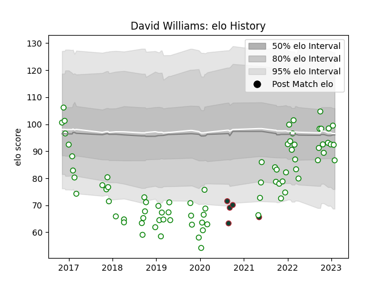

---  
layout: page  
title: David Williams  
date: 2022-12-18 16:36:43.600065  
categories: player  
---
# David Williams

## Positions: W

## Current elo: 79.0

## Current Percentile: 8.0

# Elo History

# Match History

| Team             |   Appearances |   Win Rate |
|:-----------------|--------------:|-----------:|
| Nottingham       |            68 |   0.389706 |
| Leicester Tigers |             5 |   0.2      |

| Opponent            |   Matches |   Win Rate |
|:--------------------|----------:|-----------:|
| Doncaster           |         9 |   0.333333 |
| London Scottish     |         7 |   0.857143 |
| Cornish Pirates     |         7 |   0.142857 |
| Jersey              |         6 |   0.25     |
| Bedford             |         6 |   0.333333 |
| Ealing Trailfinders |         5 |   0.4      |
| Hartpury College    |         5 |   0.4      |
| Richmond            |         4 |   0.5      |
| Coventry            |         4 |   0.375    |
| London Irish        |         4 |   0.25     |
| Ampthill            |         3 |   0.666667 |
| Yorkshire Carnegie  |         3 |   0.666667 |
| Bristol Rugby       |         2 |   0        |
| Sale Sharks         |         2 |   0        |
| Exeter Chiefs       |         1 |   0        |
| Caldy               |         1 |   1        |
| London Welsh        |         1 |   0        |
| Newcastle Falcons   |         1 |   0        |
| Rotherham Titans    |         1 |   0.5      |
| Saracens            |         1 |   0        |