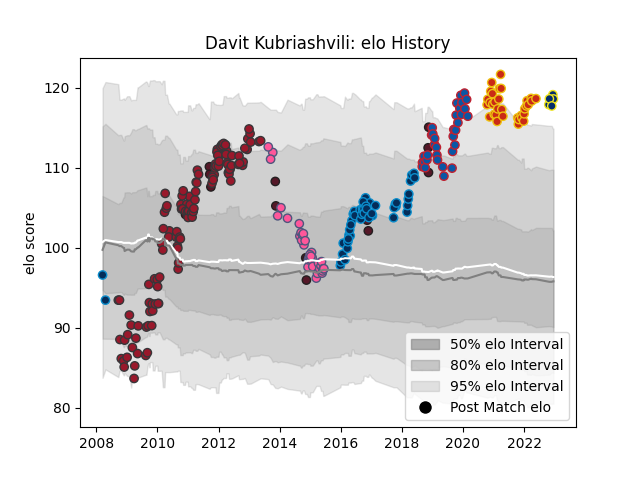

---  
layout: page  
title: Davit Kubriashvili  
date: 2022-12-18 16:25:54.636176  
categories: player  
---
# Davit Kubriashvili

## Positions: P

## Country: Georgia

## Current elo: 119.0

## Current Percentile: 97.0

# Elo History

# Match History

| Team                 |   Appearances |   Win Rate |
|:---------------------|--------------:|-----------:|
| Toulon               |           116 |   0.633621 |
| Montpellier Herault  |            47 |   0.617021 |
| Grenoble             |            34 |   0.455882 |
| Perpignan            |            33 |   0.590909 |
| Stade Francais Paris |            33 |   0.560606 |
| Georgia              |            14 |   0.285714 |
| Clermont Auvergne    |             5 |   0.3      |

| Opponent                   |   Matches |   Win Rate |
|:---------------------------|----------:|-----------:|
| Castres Olympique          |        18 |   0.444444 |
| Clermont Auvergne          |        17 |   0.5      |
| Stade Toulousain           |        16 |   0.4375   |
| Racing 92                  |        15 |   0.666667 |
| Montpellier Herault        |        14 |   0.5      |
| Brive                      |        12 |   0.583333 |
| Perpignan                  |        12 |   0.583333 |
| Biarritz Olympique         |        11 |   0.590909 |
| Stade Francais Paris       |        11 |   0.454545 |
| Lyon                       |         9 |   0.666667 |
| Agen                       |         9 |   0.5      |
| Bordeaux Begles            |         9 |   0.611111 |
| Toulon                     |         8 |   0.5      |
| La Rochelle                |         7 |   0.642857 |
| Bayonne                    |         7 |   0.642857 |
| Grenoble                   |         6 |   0.666667 |
| Pau                        |         6 |   0.5      |
| Bourgoin-Jallieu           |         5 |   1        |
| Oyonnax                    |         5 |   0.6      |
| Montauban                  |         4 |   0.75     |
| Mont-de-Marsan             |         4 |   0.75     |
| Harlequins                 |         4 |   0.75     |
| Provence Rugby             |         3 |   1        |
| Soyaux-Angouleme           |         3 |   1        |
| Aurillac                   |         3 |   0.833333 |
| Dragons                    |         3 |   0.333333 |
| Leinster                   |         3 |   0.333333 |
| Newcastle Falcons          |         3 |   0.666667 |
| Nevers                     |         3 |   1        |
| Cardiff Blues              |         3 |   0.666667 |
| Sale Sharks                |         3 |   1        |
| Munster                    |         2 |   0.5      |
| Saracens                   |         2 |   0.5      |
| Northampton Saints         |         2 |   0        |
| United States of America   |         2 |   0.5      |
| Scotland                   |         2 |   0        |
| Lusitanos XV               |         2 |   1        |
| Albi                       |         2 |   0.5      |
| London Irish               |         2 |   0.5      |
| Beziers                    |         2 |   0.5      |
| Carcassonne                |         2 |   1        |
| Colomiers                  |         2 |   0        |
| Dax                        |         2 |   0.5      |
| Vannes                     |         2 |   0.5      |
| Italy                      |         2 |   0        |
| Japan                      |         2 |   0.5      |
| Bucuresti                  |         1 |   1        |
| Valence Romans Drome Rugby |         1 |   1        |
| Argentina                  |         1 |   0        |
| Benetton Treviso           |         1 |   0        |
| Tonga                      |         1 |   0        |
| Stormers                   |         1 |   1        |
| Leicester Tigers           |         1 |   0        |
| Ireland                    |         1 |   0        |
| Canada                     |         1 |   1        |
| Petrarca Padova            |         1 |   1        |
| Samoa                      |         1 |   1        |
| Roval Drome XV             |         1 |   1        |
| Rouen                      |         1 |   1        |
| England                    |         1 |   0        |
| Exeter Chiefs              |         1 |   0        |
| Ospreys                    |         1 |   1        |