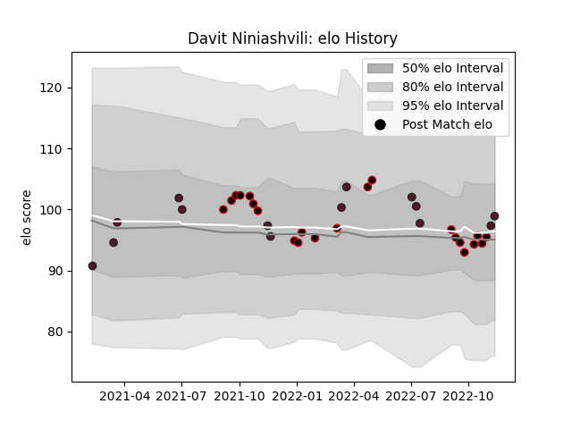

---  
layout: page  
title: Davit Niniashvili  
date: 2022-12-12 14:55:13.265256  
categories: player  
---
# Davit Niniashvili

## Positions: FB, W

## Country: Georgia

## Current elo: 98.0

## Current Percentile: 58.0

# Elo History

# Match History

| Team    |   Appearances |   Win Rate |
|:--------|--------------:|-----------:|
| Lyon    |            24 |   0.583333 |
| Georgia |            15 |   0.7      |

| Opponent             |   Matches |   Win Rate |
|:---------------------|----------:|-----------:|
| Perpignan            |         3 |   0.666667 |
| Montpellier Herault  |         3 |   0.666667 |
| Racing 92            |         3 |   0.333333 |
| Russia               |         2 |   1        |
| Bordeaux Begles      |         2 |   0.5      |
| Brive                |         2 |   1        |
| Clermont Auvergne    |         2 |   0.5      |
| Stade Toulousain     |         2 |   1        |
| Stade Francais Paris |         2 |   0.5      |
| La Rochelle          |         2 |   0        |
| Spain                |         2 |   1        |
| Pau                  |         2 |   1        |
| Uruguay              |         1 |   1        |
| South Africa         |         1 |   0        |
| Samoa                |         1 |   0        |
| Argentina            |         1 |   0        |
| Romania              |         1 |   1        |
| Portugal             |         1 |   1        |
| Bayonne              |         1 |   0        |
| Netherlands          |         1 |   1        |
| Italy                |         1 |   1        |
| France               |         1 |   0        |
| Fiji                 |         1 |   0.5      |
| Wales                |         1 |   1        |