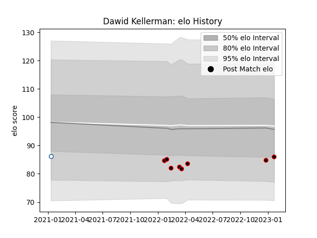

---  
layout: page  
title: Dawid Kellerman  
date: 2023-03-21 18:06:09.061297  
categories: player  
---
# Dawid Kellerman

Last updated: 2023-03-21
## Positions: C, W

## Current elo: 91.0

## Current Percentile: 20.0

# Elo History

# Match History

| Team           |   Appearances |   Win Rate |
|:---------------|--------------:|-----------:|
| Mie Honda Heat |            11 |   0.636364 |
| Blue Bulls     |             1 |   0        |

| Opponent                         |   Matches |   Win Rate |
|:---------------------------------|----------:|-----------:|
| Green Rockets Tokatsu            |         2 |        0.5 |
| Hanazono Kintetsu Liners         |         2 |        0   |
| Mitsubishi Dynaboars             |         2 |        0.5 |
| Hino Red Dolphins                |         1 |        1   |
| Kamaishi Seawaves                |         1 |        1   |
| Pumas                            |         1 |        0   |
| Shimizu Blue Sharks              |         1 |        1   |
| Skyactivs Hiroshima              |         1 |        1   |
| Toyota Industries Shuttles Aichi |         1 |        1   |