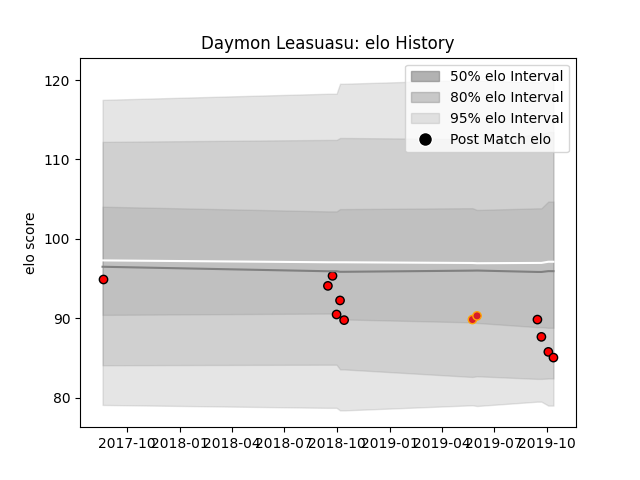

---  
layout: page  
title: Daymon Leasuasu  
date: 2023-03-21 18:54:22.452122  
categories: player  
---
# Daymon Leasuasu

Last updated: 2023-03-21
## Positions: L

## Current elo: 79.0

## Current Percentile: 11.0

# Elo History

# Match History

| Team             |   Appearances |   Win Rate |
|:-----------------|--------------:|-----------:|
| Black Rams Tokyo |            18 |   0.333333 |
| Counties Manukau |            10 |   0.1      |
| Chiefs           |             2 |   1        |

| Opponent                        |   Matches |   Win Rate |
|:--------------------------------|----------:|-----------:|
| Shizuoka Blue Revs              |         3 |   0.333333 |
| Auckland                        |         2 |   0.5      |
| Kobelco Kobe Steelers           |         2 |   0        |
| NTT Docomo Red Hurricanes Osaka |         2 |   0.5      |
| Yokohama Canon Eagles           |         2 |   0        |
| Green Rockets Tokatsu           |         2 |   1        |
| Hino Red Dolphins               |         1 |   1        |
| Crusaders                       |         1 |   1        |
| Wellington                      |         1 |   0        |
| Urayasu D-Rocks                 |         1 |   0        |
| Toyota Verblitz                 |         1 |   0        |
| Tokyo Sungoliath                |         1 |   0        |
| Tasman                          |         1 |   0        |
| Southland                       |         1 |   0        |
| Saitama Wild Knights            |         1 |   0        |
| Hawke's Bay                     |         1 |   0        |
| Queensland Reds                 |         1 |   1        |
| Northland                       |         1 |   0        |
| Canterbury                      |         1 |   0        |
| Munakata Sanix Blues            |         1 |   1        |
| Mie Honda Heat                  |         1 |   0        |
| Manawatu                        |         1 |   0        |
| North Harbour                   |         1 |   0        |