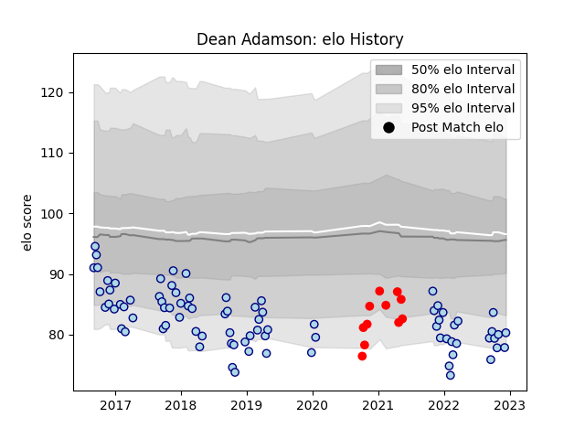

---  
layout: page  
title: Dean Adamson  
date: 2023-03-21 18:02:27.823616  
categories: player  
---
# Dean Adamson

Last updated: 2023-03-21
## Positions: W

## Current elo: 98.0

## Current Percentile: 73.0

# Elo History

# Match History

| Team    |   Appearances |   Win Rate |
|:--------|--------------:|-----------:|
| Bedford |            92 |   0.51087  |
| Rouen   |            11 |   0.363636 |

| Opponent                   |   Matches |   Win Rate |
|:---------------------------|----------:|-----------:|
| London Scottish            |        11 |   0.772727 |
| Cornish Pirates            |         9 |   0.444444 |
| Doncaster                  |         9 |   0.388889 |
| Nottingham                 |         8 |   0.75     |
| Ealing Trailfinders        |         8 |   0.25     |
| Hartpury College           |         7 |   0.714286 |
| Richmond                   |         7 |   0.714286 |
| Jersey                     |         7 |   0.571429 |
| Yorkshire Carnegie         |         6 |   0.333333 |
| Rotherham Titans           |         4 |   1        |
| Coventry                   |         4 |   0        |
| Ampthill                   |         3 |   0.333333 |
| London Irish               |         3 |   0        |
| Colomiers                  |         2 |   0        |
| Caldy                      |         2 |   0.5      |
| Bristol Rugby              |         2 |   0        |
| Vannes                     |         2 |   0        |
| Aurillac                   |         1 |   1        |
| Carcassonne                |         1 |   0        |
| London Welsh               |         1 |   1        |
| Newcastle Falcons          |         1 |   0        |
| Perpignan                  |         1 |   1        |
| Provence Rugby             |         1 |   0        |
| Biarritz Olympique         |         1 |   0        |
| Soyaux-Angouleme           |         1 |   1        |
| Valence Romans Drome Rugby |         1 |   1        |