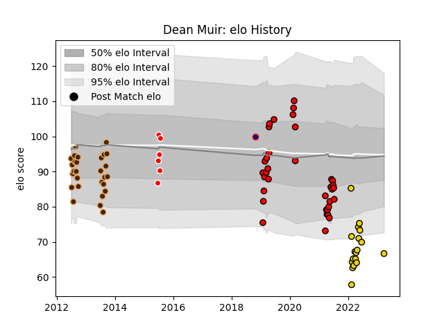

---  
layout: page  
title: Dean Muir  
date: 2023-03-29 11:30:25.545235  
categories: player  
---
# Dean Muir

Last updated: 2023-03-29
## Positions: H

## Current elo: 67.0

## Current Percentile: 3.0

# Elo History

# Match History

| Team                     |   Appearances |   Win Rate |
|:-------------------------|--------------:|-----------:|
| San Diego Legion         |            35 |   0.557143 |
| Border Bulldogs          |            28 |   0.142857 |
| Houston SaberCats        |            18 |   0.555556 |
| Valke                    |             6 |   0.5      |
| Hanazono Kintetsu Liners |             1 |   1        |

| Opponent               |   Matches |   Win Rate |
|:-----------------------|----------:|-----------:|
| Seattle Seawolves      |         9 |   0.555556 |
| Leopards               |         5 |   0.2      |
| Boland Cavaliers       |         5 |   0.2      |
| Utah Warriors          |         5 |   0.8      |
| SWD Eagles             |         5 |   0.2      |
| Rugby New York         |         5 |   0.4      |
| R.U. New York          |         5 |   0.4      |
| Griffons               |         5 |   0.4      |
| L. A. Giltinis         |         4 |   0.25     |
| Pumas                  |         4 |   0        |
| Valke                  |         4 |   0.25     |
| Eastern Province Kings |         4 |   0        |
| Houston SaberCats      |         3 |   0.666667 |
| Rugby ATL              |         3 |   0.333333 |
| Toronto Arrows         |         3 |   0.666667 |
| Austin Gilgronis       |         2 |   0        |
| New England Free Jacks |         2 |   0.5      |
| Old Glory DC           |         2 |   0.5      |
| Glendale Raptors       |         2 |   0.75     |
| Dallas Jackals         |         2 |   1        |
| San Diego Legion       |         2 |   0.5      |
| Austin Elite Rugby     |         2 |   1        |
| Kamaishi Seawaves      |         1 |   1        |
| NOLA Gold              |         1 |   1        |
| Griquas                |         1 |   0        |
| Colorado Raptors       |         1 |   1        |
| Border Bulldogs        |         1 |   1        |