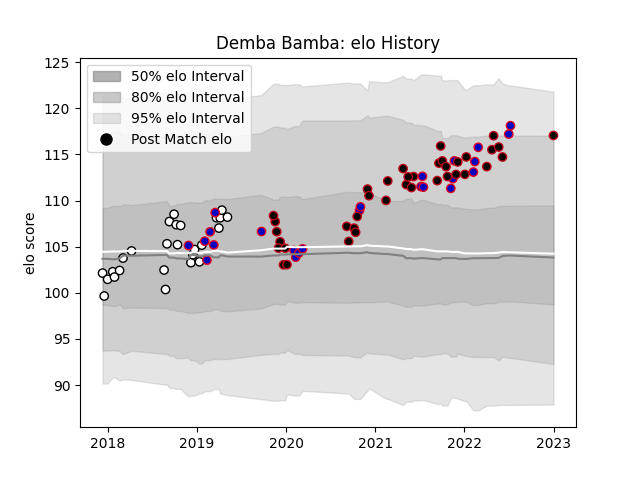

---  
layout: page  
title: Demba Bamba  
date: 2023-01-01 11:19:07.304548  
categories: player  
---
# Demba Bamba

## Positions: P

## Country: France

## Current elo: 111.0

## Current Percentile: 93.0

# Elo History

# Match History

| Team   |   Appearances |   Win Rate |
|:-------|--------------:|-----------:|
| Lyon   |            38 |   0.513158 |
| Brive  |            26 |   0.557692 |
| France |            24 |   0.708333 |

| Opponent             |   Matches |   Win Rate |
|:---------------------|----------:|-----------:|
| Racing 92            |         5 |   0.2      |
| La Rochelle          |         4 |   0.5      |
| Bayonne              |         4 |   0.75     |
| Pau                  |         4 |   0.375    |
| Brive                |         4 |   0.75     |
| Toulon               |         3 |   0        |
| Stade Francais Paris |         3 |   0.333333 |
| Bordeaux Begles      |         3 |   0.333333 |
| Ireland              |         3 |   0.666667 |
| Scotland             |         3 |   0.666667 |
| Australia            |         3 |   0.333333 |
| Wales                |         3 |   0.666667 |
| Montpellier Herault  |         3 |   0.666667 |
| Italy                |         3 |   1        |
| Stade Toulousain     |         2 |   1        |
| Soyaux-Angouleme     |         2 |   1        |
| Argentina            |         2 |   1        |
| Japan                |         2 |   1        |
| Agen                 |         2 |   1        |
| Colomiers            |         2 |   0.5      |
| England              |         2 |   0.5      |
| Aurillac             |         2 |   0.5      |
| Biarritz Olympique   |         2 |   0.75     |
| Connacht             |         2 |   0        |
| Castres Olympique    |         2 |   0        |
| Perpignan            |         1 |   1        |
| US Bressane          |         1 |   1        |
| Benetton Treviso     |         1 |   1        |
| Beziers              |         1 |   1        |
| Carcassonne          |         1 |   1        |
| Clermont Auvergne    |         1 |   1        |
| Provence Rugby       |         1 |   0        |
| Georgia              |         1 |   1        |
| Fiji                 |         1 |   0        |
| Northampton Saints   |         1 |   0        |
| New Zealand          |         1 |   1        |
| Nevers               |         1 |   1        |
| Montauban            |         1 |   1        |
| Mont-de-Marsan       |         1 |   1        |
| Massy                |         1 |   0        |
| Lyon                 |         1 |   0        |
| Leinster             |         1 |   0        |
| Worcester Warriors   |         1 |   1        |