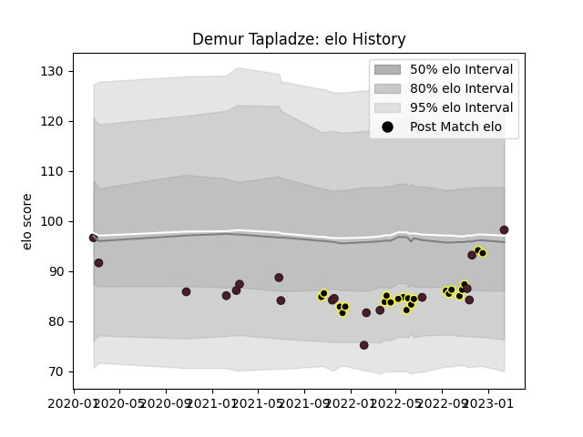

---  
layout: page  
title: Demur Tapladze  
date: 2023-02-15 22:14:57.879866  
categories: player  
---
# Demur Tapladze

## Positions: C, W

## Country: Georgia

## Current elo: 98.0

## Current Percentile: 43.0

# Elo History

# Match History

| Team       |   Appearances |   Win Rate |
|:-----------|--------------:|-----------:|
| Black Lion |            22 |   0.795455 |
| Georgia    |            18 |   0.722222 |

| Opponent                 |   Matches |   Win Rate |
|:-------------------------|----------:|-----------:|
| Tel-Aviv Heat            |         5 |   0.7      |
| Netherlands              |         3 |   1        |
| Portugal                 |         3 |   0.833333 |
| RC Batumi                |         2 |   1        |
| Castilla y Leon Iberians |         2 |   1        |
| Spain                    |         2 |   1        |
| Lokomotiv Penza          |         2 |   0.5      |
| Romanian Wolves          |         2 |   1        |
| Wales                    |         1 |   1        |
| Uruguay                  |         1 |   1        |
| South Africa             |         1 |   0        |
| Scotland                 |         1 |   0        |
| Samoa                    |         1 |   0        |
| SWD Eagles               |         1 |   1        |
| Russia                   |         1 |   1        |
| Belgium                  |         1 |   1        |
| Boland Cavaliers         |         1 |   0        |
| Lusitanos XV             |         1 |   1        |
| Leopards                 |         1 |   1        |
| Italy                    |         1 |   1        |
| Griffons                 |         1 |   0        |
| France                   |         1 |   0        |
| Fiji                     |         1 |   0.5      |
| Enisey-STM Krasnoyarsk   |         1 |   1        |
| Eastern Province Kings   |         1 |   1        |
| Border Bulldogs          |         1 |   1        |
| Zimbabwe Goshawks        |         1 |   1        |