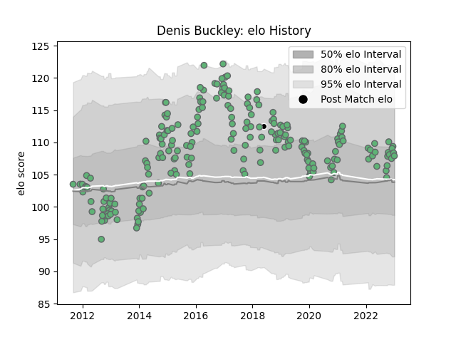

---  
layout: page  
title: Denis Buckley  
date: 2022-12-09 13:09:06.684590  
categories: player  
---
# Denis Buckley

## Positions: P

## Country: Barbarians

## Current elo: 104.0

## Current Percentile: 76.0

# Elo History

# Match History

| Team       |   Appearances |   Win Rate |
|:-----------|--------------:|-----------:|
| Connacht   |           210 |   0.495238 |
| Barbarians |             1 |   1        |

| Opponent            |   Matches |   Win Rate |
|:--------------------|----------:|-----------:|
| Zebre               |        17 |   0.882353 |
| Cardiff Blues       |        16 |   0.46875  |
| Ulster              |        16 |   0.25     |
| Munster             |        16 |   0.3125   |
| Leinster            |        16 |   0.3125   |
| Glasgow Warriors    |        15 |   0.1      |
| Edinburgh           |        14 |   0.571429 |
| Benetton Treviso    |        14 |   0.928571 |
| Ospreys             |        12 |   0.416667 |
| Scarlets            |        12 |   0.333333 |
| Dragons             |        11 |   0.909091 |
| Stade Toulousain    |         5 |   0.2      |
| Gloucester Rugby    |         5 |   0.2      |
| Cheetahs            |         5 |   0.8      |
| Southern Kings      |         4 |   1        |
| Harlequins          |         3 |   0.333333 |
| Brive               |         3 |   0.666667 |
| Sale Sharks         |         3 |   0.333333 |
| RC Enisei           |         2 |   1        |
| Stormers            |         2 |   0.5      |
| Wasps               |         2 |   0.5      |
| Montpellier Herault |         2 |   0.5      |
| Aironi              |         2 |   0.5      |
| Biarritz Olympique  |         2 |   0.5      |
| Bayonne             |         2 |   1        |
| Exeter Chiefs       |         2 |   0        |
| Saracens            |         1 |   0        |
| Lions               |         1 |   1        |
| Sharks              |         1 |   0        |
| La Rochelle         |         1 |   1        |
| Grenoble            |         1 |   0        |
| England             |         1 |   1        |
| Worcester Warriors  |         1 |   1        |
| Bulls               |         1 |   0        |