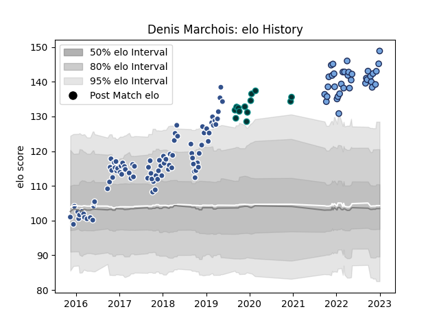

---  
layout: page  
title: Denis Marchois  
date: 2023-02-02 19:12:19.887371  
categories: player  
---
# Denis Marchois

## Positions: L, FL

## Current elo: 162.0

## Current Percentile: 99.0

# Elo History

# Match History

| Team    |   Appearances |   Win Rate |
|:--------|--------------:|-----------:|
| Agen    |            89 |   0.404494 |
| Bayonne |            40 |   0.65     |
| Pau     |            13 |   0.538462 |

| Opponent             |   Matches |   Win Rate |
|:---------------------|----------:|-----------:|
| Grenoble             |         8 |   0.4375   |
| Clermont Auvergne    |         7 |   0.428571 |
| Pau                  |         7 |   0.214286 |
| Bordeaux Begles      |         7 |   0.285714 |
| Castres Olympique    |         6 |   0.333333 |
| Oyonnax              |         6 |   0.5      |
| Racing 92            |         6 |   0.333333 |
| Montpellier Herault  |         6 |   0.166667 |
| Stade Toulousain     |         6 |   0.166667 |
| Toulon               |         6 |   0.5      |
| Perpignan            |         5 |   0.8      |
| Stade Francais Paris |         5 |   0.4      |
| Brive                |         4 |   0.75     |
| Lyon                 |         4 |   0.5      |
| Colomiers            |         4 |   0.375    |
| Montauban            |         3 |   1        |
| Mont-de-Marsan       |         3 |   0.666667 |
| Aurillac             |         3 |   0.666667 |
| La Rochelle          |         3 |   0.333333 |
| London Irish         |         3 |   0        |
| Narbonne             |         3 |   0.666667 |
| Carcassonne          |         3 |   0.666667 |
| US Bressane          |         2 |   1        |
| Vannes               |         2 |   1        |
| Rouen                |         2 |   1        |
| Soyaux-Angouleme     |         2 |   1        |
| Provence Rugby       |         2 |   0.5      |
| Agen                 |         2 |   0.75     |
| Cardiff Blues        |         2 |   0.5      |
| Calvisano            |         2 |   1        |
| Bourgoin-Jallieu     |         2 |   1        |
| Beziers              |         2 |   0.5      |
| Benetton Treviso     |         2 |   0.5      |
| Zebre                |         2 |   0.5      |
| Nevers               |         1 |   1        |
| Albi                 |         1 |   0        |
| Leicester Tigers     |         1 |   1        |
| Harlequins           |         1 |   0        |
| Gloucester Rugby     |         1 |   0        |
| Edinburgh            |         1 |   0        |
| Dax                  |         1 |   1        |
| Scarlets             |         1 |   0        |
| Biarritz Olympique   |         1 |   0        |
| Worcester Warriors   |         1 |   1        |