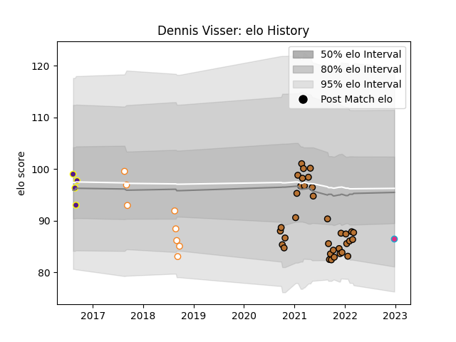

---  
layout: page  
title: Dennis Visser  
date: 2023-01-13 11:26:07.574695  
categories: player  
---
# Dennis Visser

## Positions: L

## Current elo: 92.0

## Current Percentile: 30.0

# Elo History

# Match History

| Team                |   Appearances |   Win Rate |
|:--------------------|--------------:|-----------:|
| Narbonne            |            35 |      0.5   |
| Free State Cheetahs |             8 |      0.125 |
| Griffons            |             4 |      0.5   |
| Zebre               |             2 |      0     |

| Opponent                   |   Matches |   Win Rate |
|:---------------------------|----------:|-----------:|
| Agen                       |         2 |        0.5 |
| Cognac Saint Jean d'Angély |         2 |        1   |
| Tarbes                     |         2 |        1   |
| Rouen                      |         2 |        0.5 |
| Provence Rugby             |         2 |        1   |
| Natal Sharks               |         2 |        0   |
| Mont-de-Marsan             |         2 |        0   |
| Dijon                      |         2 |        0.5 |
| Dax                        |         2 |        0.5 |
| Western Province           |         2 |        0   |
| Carcassonne                |         2 |        0   |
| Blue Bulls                 |         2 |        0.5 |
| Aubenas                    |         2 |        0.5 |
| Aurillac                   |         2 |        0   |
| Blagnac                    |         2 |        1   |
| Golden Lions               |         1 |        0   |
| Benetton Treviso           |         1 |        0   |
| Vannes                     |         1 |        0.5 |
| Valke                      |         1 |        1   |
| US Bressane                |         1 |        1   |
| Bourgoin-Jallieu           |         1 |        1   |
| Suresnes                   |         1 |        0   |
| Border Bulldogs            |         1 |        0   |
| Pumas                      |         1 |        0   |
| Nice                       |         1 |        1   |
| Grenoble                   |         1 |        0   |
| Nevers                     |         1 |        0   |
| Colomiers                  |         1 |        0   |
| Namibia Welwitchias        |         1 |        1   |
| Montauban                  |         1 |        0   |
| Edinburgh                  |         1 |        0   |
| Massy                      |         1 |        1   |
| Albi                       |         1 |        0   |
| Leopards                   |         1 |        0   |