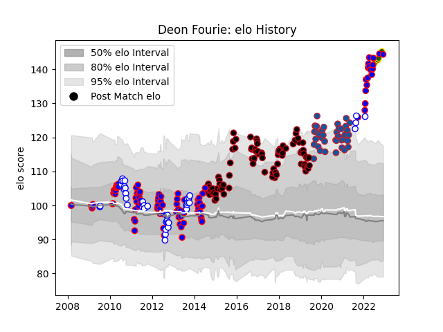

---  
layout: page  
title: Deon Fourie  
date: 2022-12-09 13:17:09.826373  
categories: player  
---
# Deon Fourie

## Positions: FL, N8

## Country: South Africa

## Current elo: 144.0

## Current Percentile: 99.0

# Elo History

# Match History

| Team             |   Appearances |   Win Rate |
|:-----------------|--------------:|-----------:|
| Stormers         |            99 |   0.651515 |
| Lyon             |            88 |   0.454545 |
| Western Province |            41 |   0.719512 |
| Grenoble         |            38 |   0.526316 |
| South Africa     |             5 |   0.4      |

| Opponent                   |   Matches |   Win Rate |
|:---------------------------|----------:|-----------:|
| Bulls                      |        14 |   0.642857 |
| Sharks                     |        10 |   0.45     |
| Golden Lions               |         9 |   0.611111 |
| Natal Sharks               |         9 |   0.555556 |
| Cheetahs                   |         9 |   0.777778 |
| Stade Toulousain           |         8 |   0.375    |
| Lions                      |         8 |   0.875    |
| Crusaders                  |         7 |   0.142857 |
| Clermont Auvergne          |         7 |   0.285714 |
| Queensland Reds            |         6 |   0.5      |
| Racing 92                  |         6 |   0.5      |
| Free State Cheetahs        |         6 |   1        |
| Oyonnax                    |         6 |   0.5      |
| Montpellier Herault        |         6 |   0.5      |
| Griquas                    |         6 |   0.916667 |
| Bordeaux Begles            |         6 |   0.5      |
| Blue Bulls                 |         6 |   0.416667 |
| Stade Francais Paris       |         6 |   0.666667 |
| Castres Olympique          |         5 |   0        |
| Perpignan                  |         5 |   0.4      |
| New South Wales Waratahs   |         5 |   0.6      |
| Toulon                     |         4 |   0.5      |
| Highlanders                |         4 |   1        |
| Aurillac                   |         4 |   0.5      |
| Western Force              |         4 |   0.75     |
| Colomiers                  |         4 |   0.5      |
| Nevers                     |         4 |   0.75     |
| Chiefs                     |         4 |   0.5      |
| Carcassonne                |         4 |   0.75     |
| Brumbies                   |         4 |   0.5      |
| Pau                        |         4 |   0.75     |
| Blues                      |         4 |   0.5      |
| Biarritz Olympique         |         4 |   0.125    |
| Ospreys                    |         3 |   0.333333 |
| Provence Rugby             |         3 |   0.666667 |
| Mont-de-Marsan             |         3 |   0.666667 |
| Melbourne Rebels           |         3 |   0.666667 |
| La Rochelle                |         3 |   0.333333 |
| Leopards                   |         3 |   1        |
| Soyaux-Angouleme           |         3 |   0.666667 |
| Bayonne                    |         3 |   0.666667 |
| Beziers                    |         3 |   0.666667 |
| Brive                      |         3 |   0.333333 |
| Cardiff Blues              |         3 |   0.333333 |
| Grenoble                   |         3 |   0.666667 |
| Hurricanes                 |         3 |   1        |
| Edinburgh                  |         2 |   1        |
| Ulster                     |         2 |   1        |
| Newcastle Falcons          |         2 |   0.5      |
| Valence Romans Drome Rugby |         2 |   1        |
| Montauban                  |         2 |   0.75     |
| Pumas                      |         2 |   1        |
| Sale Sharks                |         2 |   0.5      |
| Saracens                   |         2 |   0        |
| Southern Kings             |         2 |   1        |
| Tarbes                     |         1 |   1        |
| Vannes                     |         1 |   0        |
| Wales                      |         1 |   0        |
| Agen                       |         1 |   0        |
| Scarlets                   |         1 |   1        |
| Leinster                   |         1 |   1        |
| Argentina                  |         1 |   1        |
| Ireland                    |         1 |   0        |
| Glasgow Warriors           |         1 |   0        |
| France                     |         1 |   0        |
| Dragons                    |         1 |   1        |
| Connacht                   |         1 |   0        |
| Bourgoin-Jallieu           |         1 |   1        |
| Benetton Treviso           |         1 |   0        |
| Australia                  |         1 |   1        |
| Zebre                      |         1 |   1        |