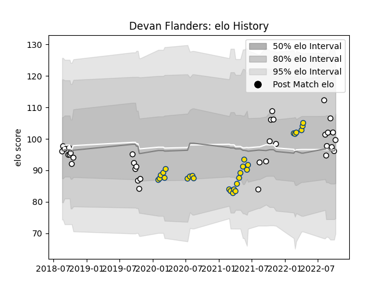

---  
layout: page  
title: Devan Flanders  
date: 2023-03-02 11:22:29.896321  
categories: player  
---
# Devan Flanders

## Positions: N8, FL

## Current elo: 100.0

## Current Percentile: 48.0

# Elo History

# Match History

| Team        |   Appearances |   Win Rate |
|:------------|--------------:|-----------:|
| Hawke's Bay |            34 |   0.573529 |
| Hurricanes  |            28 |   0.535714 |

| Opponent                 |   Matches |   Win Rate |
|:-------------------------|----------:|-----------:|
| Tasman                   |         5 |   0.4      |
| Chiefs                   |         5 |   0.4      |
| Crusaders                |         5 |   0.2      |
| Highlanders              |         5 |   0.8      |
| Otago                    |         5 |   0.6      |
| Bay of Plenty            |         4 |   0.25     |
| Blues                    |         4 |   0.25     |
| Waikato                  |         3 |   0.833333 |
| Counties Manukau         |         3 |   0.666667 |
| Manawatu                 |         3 |   1        |
| North Harbour            |         2 |   0.5      |
| Taranaki                 |         2 |   0.5      |
| Southland                |         2 |   1        |
| Wellington               |         2 |   0        |
| Canterbury               |         2 |   0.5      |
| Northland                |         1 |   1        |
| Moana Pasifika           |         1 |   1        |
| Queensland Reds          |         1 |   1        |
| Sharks                   |         1 |   1        |
| Melbourne Rebels         |         1 |   1        |
| Stormers                 |         1 |   0        |
| Sunwolves                |         1 |   1        |
| Jaguares                 |         1 |   1        |
| Brumbies                 |         1 |   0        |
| New South Wales Waratahs |         1 |   1        |