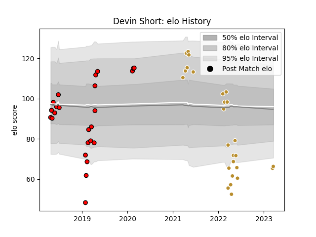

---  
layout: page  
title: Devin Short  
date: 2023-03-16 11:32:07.060444  
categories: player  
---
# Devin Short

## Positions: FL

## Current elo: 65.0

## Current Percentile: 2.0

# Elo History

# Match History

| Team             |   Appearances |   Win Rate |
|:-----------------|--------------:|-----------:|
| NOLA Gold        |            25 |   0.38     |
| San Diego Legion |            24 |   0.645833 |

| Opponent               |   Matches |   Win Rate |
|:-----------------------|----------:|-----------:|
| Rugby New York         |         5 |   0.4      |
| Seattle Seawolves      |         5 |   0.6      |
| Toronto Arrows         |         5 |   0.2      |
| Glendale Raptors       |         4 |   0.625    |
| New England Free Jacks |         4 |   0.5      |
| Old Glory DC           |         4 |   0.875    |
| R.U. New York          |         4 |   0.25     |
| Rugby ATL              |         4 |   0        |
| Austin Elite Rugby     |         3 |   0.666667 |
| Houston SaberCats      |         3 |   1        |
| Austin Gilgronis       |         2 |   0        |
| Utah Warriors          |         2 |   1        |
| Colorado Raptors       |         1 |   1        |
| Dallas Jackals         |         1 |   1        |
| NOLA Gold              |         1 |   1        |
| San Diego Legion       |         1 |   0        |