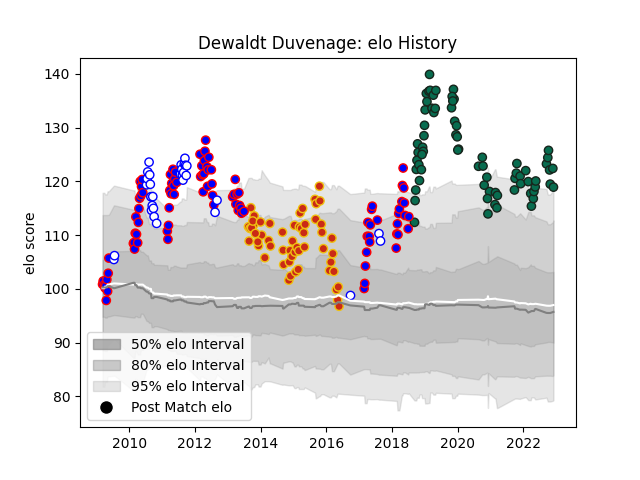

---  
layout: page  
title: Dewaldt Duvenage  
date: 2022-12-09 13:11:01.661729  
categories: player  
---
# Dewaldt Duvenage

## Positions: SH

## Current elo: 119.0

## Current Percentile: 97.0

# Elo History

# Match History

| Team             |   Appearances |   Win Rate |
|:-----------------|--------------:|-----------:|
| Stormers         |            93 |   0.623656 |
| Benetton Treviso |            70 |   0.421429 |
| Perpignan        |            56 |   0.5      |
| Western Province |            31 |   0.580645 |

| Opponent                 |   Matches |   Win Rate |
|:-------------------------|----------:|-----------:|
| Bulls                    |        12 |   0.5      |
| Sharks                   |        11 |   0.454545 |
| Edinburgh                |         8 |   0.625    |
| Cheetahs                 |         8 |   0.875    |
| Lions                    |         8 |   0.75     |
| Crusaders                |         7 |   0.142857 |
| Chiefs                   |         7 |   0.428571 |
| Zebre                    |         7 |   0.857143 |
| Scarlets                 |         7 |   0.285714 |
| Natal Sharks             |         7 |   0.285714 |
| New South Wales Waratahs |         6 |   0.5      |
| Blues                    |         6 |   0.833333 |
| Blue Bulls               |         6 |   0.5      |
| Highlanders              |         6 |   0.666667 |
| Queensland Reds          |         5 |   0.6      |
| Munster                  |         5 |   0        |
| Griquas                  |         5 |   0.8      |
| Southern Kings           |         5 |   1        |
| Glasgow Warriors         |         5 |   0.6      |
| Hurricanes               |         5 |   0.6      |
| Connacht                 |         5 |   0        |
| Leinster                 |         4 |   0.125    |
| Dragons                  |         4 |   0.625    |
| Brumbies                 |         4 |   0.5      |
| Free State Cheetahs      |         4 |   0.25     |
| Western Force            |         4 |   0.75     |
| Biarritz Olympique       |         4 |   0.75     |
| Cardiff Blues            |         4 |   0.5      |
| Albi                     |         4 |   0.5      |
| Leopards                 |         4 |   1        |
| Dax                      |         3 |   0.333333 |
| Montauban                |         3 |   0.333333 |
| Aurillac                 |         3 |   0.166667 |
| Stade Francais Paris     |         3 |   0.333333 |
| Jaguares                 |         3 |   0.666667 |
| Ospreys                  |         3 |   0        |
| Tarbes                   |         3 |   0.333333 |
| Grenoble                 |         3 |   1        |
| Golden Lions             |         3 |   0.666667 |
| Ulster                   |         3 |   0.166667 |
| Colomiers                |         3 |   0.166667 |
| Bourgoin-Jallieu         |         3 |   0.666667 |
| Sunwolves                |         2 |   0.5      |
| Beziers                  |         2 |   1        |
| Pumas                    |         2 |   1        |
| Pau                      |         2 |   0.5      |
| Oyonnax                  |         2 |   0.5      |
| Montpellier Herault      |         2 |   0.5      |
| Northampton Saints       |         2 |   0        |
| Melbourne Rebels         |         2 |   1        |
| Harlequins               |         2 |   0.5      |
| Carcassonne              |         2 |   1        |
| Massy                    |         2 |   1        |
| Agen                     |         2 |   0.5      |
| Mont-de-Marsan           |         2 |   0.5      |
| Narbonne                 |         2 |   1        |
| Bordeaux Begles          |         1 |   0        |
| Brive                    |         1 |   0        |
| Provence Rugby           |         1 |   1        |
| Stormers                 |         1 |   1        |
| Castres Olympique        |         1 |   1        |
| Toulon                   |         1 |   0        |
| Gloucester Rugby         |         1 |   0        |
| Clermont Auvergne        |         1 |   0        |
| Lyon                     |         1 |   1        |