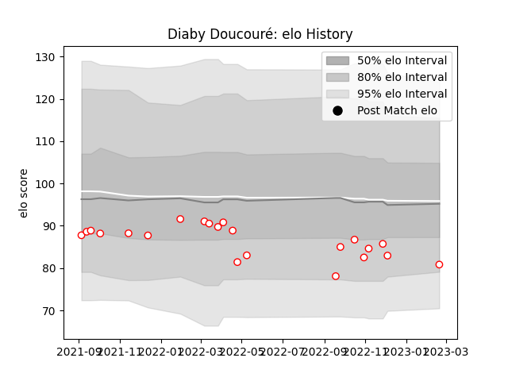

---  
layout: page  
title: Diaby Doucouré  
date: 2023-02-24 02:22:28.078460  
categories: player  
---
# Diaby Doucouré

## Positions: FL, N8

## Current elo: 81.0

## Current Percentile: 15.0

# Elo History

# Match History

| Team   |   Appearances |   Win Rate |
|:-------|--------------:|-----------:|
| Dax    |            22 |        0.5 |

| Opponent                   |   Matches |   Win Rate |
|:---------------------------|----------:|-----------:|
| Suresnes                   |         3 |   0.666667 |
| Blagnac                    |         2 |   0.5      |
| Bourgoin-Jallieu           |         2 |   0        |
| Chambery                   |         2 |   0.5      |
| Cognac Saint Jean d'Angély |         2 |   0        |
| Dijon                      |         2 |   0.5      |
| Tarbes                     |         2 |   1        |
| Albi                       |         1 |   0        |
| Aubenas                    |         1 |   1        |
| Carqueiranne-Hyères        |         1 |   1        |
| Massy                      |         1 |   0        |
| Nice                       |         1 |   0        |
| Rennes                     |         1 |   1        |
| Valence Romans Drome Rugby |         1 |   1        |