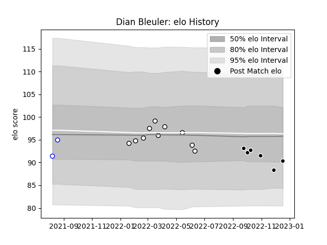

---  
layout: page  
title: Dian Bleuler  
date: 2023-01-06 00:25:25.134847  
categories: player  
---
# Dian Bleuler

## Positions: P

## Current elo: 99.0

## Current Percentile: 15.0

# Elo History

# Match History

| Team             |   Appearances |   Win Rate |
|:-----------------|--------------:|-----------:|
| Natal Sharks     |            10 |      0.5   |
| Sharks           |             8 |      0.625 |
| Western Province |             6 |      0.75  |

| Opponent            |   Matches |   Win Rate |
|:--------------------|----------:|-----------:|
| Free State Cheetahs |         3 |   0.333333 |
| Golden Lions        |         3 |   0.666667 |
| Griquas             |         3 |   0.666667 |
| Pumas               |         3 |   0.833333 |
| Bulls               |         2 |   0.5      |
| Western Province    |         2 |   0.5      |
| Blue Bulls          |         1 |   0        |
| Bordeaux Begles     |         1 |   1        |
| Cardiff Blues       |         1 |   0        |
| Dragons             |         1 |   1        |
| Leinster            |         1 |   0        |
| Lions               |         1 |   1        |
| Natal Sharks        |         1 |   1        |
| Zebre               |         1 |   1        |