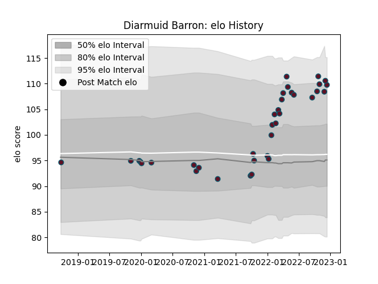

---  
layout: page  
title: Diarmuid Barron  
date: 2022-12-18 16:29:57.486857  
categories: player  
---
# Diarmuid Barron

## Positions: H

## Current elo: 110.0

## Current Percentile: 88.0

# Elo History

# Match History

| Team    |   Appearances |   Win Rate |
|:--------|--------------:|-----------:|
| Munster |            35 |   0.628571 |

| Opponent         |   Matches |   Win Rate |
|:-----------------|----------:|-----------:|
| Ulster           |         5 |       0.4  |
| Cardiff Blues    |         4 |       0.5  |
| Connacht         |         4 |       0.75 |
| Leinster         |         4 |       0    |
| Benetton Treviso |         2 |       1    |
| Bulls            |         2 |       0.5  |
| Dragons          |         2 |       1    |
| Edinburgh        |         2 |       1    |
| Scarlets         |         2 |       1    |
| Zebre            |         2 |       1    |
| Glasgow Warriors |         1 |       0    |
| Ospreys          |         1 |       1    |
| Sharks           |         1 |       1    |
| Stade Toulousain |         1 |       0    |
| Stormers         |         1 |       1    |
| Wasps            |         1 |       1    |