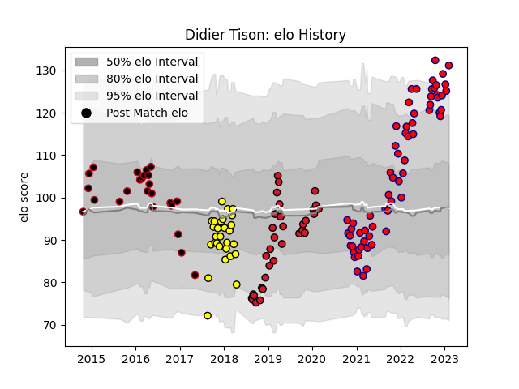

---  
layout: page  
title: Didier Tison  
date: 2023-03-17 17:06:20.473983  
categories: player  
---
# Didier Tison

## Positions: N8, FL

## Current elo: 131.0

## Current Percentile: 94.0

# Elo History

# Match History

| Team        |   Appearances |   Win Rate |
|:------------|--------------:|-----------:|
| Aurillac    |            61 |   0.532787 |
| Oyonnax     |            33 |   0.651515 |
| Carcassonne |            28 |   0.392857 |
| Lyon        |            24 |   0.625    |

| Opponent                   |   Matches |   Win Rate |
|:---------------------------|----------:|-----------:|
| Montauban                  |        11 |   0.590909 |
| Beziers                    |        10 |   0.6      |
| Carcassonne                |        10 |   0.6      |
| Biarritz Olympique         |         9 |   0.333333 |
| Mont-de-Marsan             |         9 |   0.222222 |
| Provence Rugby             |         8 |   0.625    |
| Colomiers                  |         8 |   0.75     |
| Vannes                     |         7 |   0.571429 |
| Grenoble                   |         7 |   0.285714 |
| Soyaux-Angouleme           |         6 |   0.666667 |
| Nevers                     |         6 |   0.666667 |
| Narbonne                   |         6 |   0.666667 |
| Rouen                      |         5 |   0.8      |
| Massy                      |         5 |   0.6      |
| Oyonnax                    |         4 |   0.5      |
| Perpignan                  |         4 |   0.375    |
| Aurillac                   |         4 |   0.75     |
| Bayonne                    |         4 |   0.5      |
| Dax                        |         3 |   1        |
| Valence Romans Drome Rugby |         2 |   0.5      |
| US Bressane                |         2 |   0.5      |
| Bordeaux Begles            |         2 |   0.5      |
| Agen                       |         2 |   0.5      |
| Ospreys                    |         2 |   0        |
| Newcastle Falcons          |         2 |   0.5      |
| Brive                      |         2 |   0        |
| Edinburgh                  |         2 |   0.5      |
| Albi                       |         1 |   1        |
| Bourgoin-Jallieu           |         1 |   1        |
| Tarbes                     |         1 |   0        |
| London Welsh               |         1 |   1        |