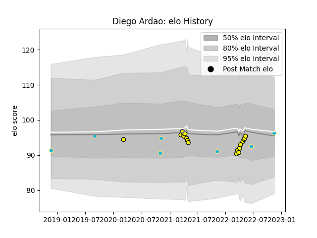

---  
layout: page  
title: Diego Ardao  
date: 2022-11-16 11:28:16.558400  
categories: player  
---
# Diego Ardao

## Positions: FL, N8

## Country: Uruguay

## Current elo: 96.0

## Current Percentile: 37.0

# Elo History

# Match History

| Team          |   Appearances |   Win Rate |
|:--------------|--------------:|-----------:|
| Penarol Rugby |            18 |   0.722222 |
| Uruguay       |             7 |   0.428571 |

| Opponent      |   Matches |   Win Rate |
|:--------------|----------:|-----------:|
| Cafeteros Pro |         4 |       1    |
| Jaguares XV   |         4 |       0.5  |
| Olimpia Lions |         4 |       0.75 |
| Selknam       |         4 |       0.5  |
| Cobras        |         2 |       1    |
| Romania       |         2 |       0.5  |
| Spain         |         2 |       0.5  |
| Brazil        |         1 |       1    |
| Fiji          |         1 |       0    |
| Japan         |         1 |       0    |