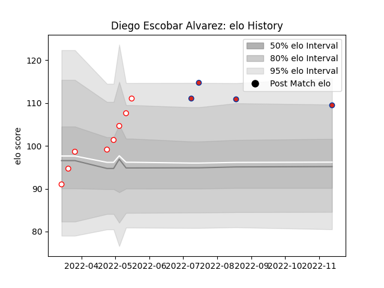

---  
layout: page  
title: Diego Escobar Alvarez  
date: 2022-11-16 11:38:13.420720  
categories: player  
---
# Diego Escobar Alvarez

## Positions: H, N8

## Country: Chile

## Current elo: 110.0

## Current Percentile: 91.0

# Elo History

# Match History

| Team    |   Appearances |   Win Rate |
|:--------|--------------:|-----------:|
| Selknam |             8 |      0.875 |
| Chile   |             4 |      0.5   |

| Opponent                 |   Matches |   Win Rate |
|:-------------------------|----------:|-----------:|
| Cobras                   |         2 |        1   |
| Jaguares XV              |         2 |        1   |
| Olimpia Lions            |         2 |        0.5 |
| United States of America |         2 |        0.5 |
| Brazil                   |         1 |        1   |
| Cafeteros Pro            |         1 |        1   |
| Penarol Rugby            |         1 |        1   |
| Tonga                    |         1 |        0   |