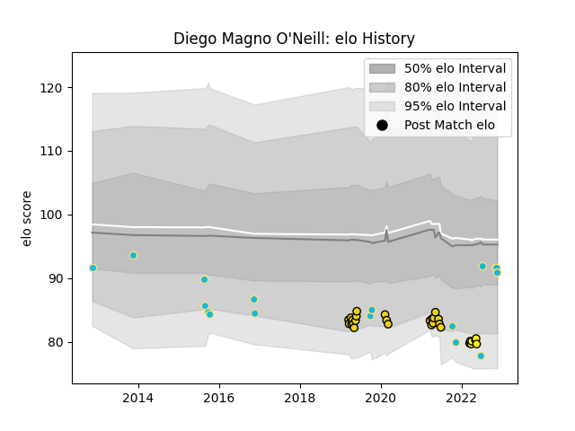

---  
layout: page  
title: Diego Magno O'Neill  
date: 2022-11-22 11:39:55.721688  
categories: player  
---
# Diego Magno O'Neill

## Positions: L, N8

## Country: Uruguay

## Current elo: 91.0

## Current Percentile: 6.0

# Elo History

# Match History

| Team              |   Appearances |   Win Rate |
|:------------------|--------------:|-----------:|
| Houston SaberCats |            22 |   0.318182 |
| Uruguay           |            17 |   0.176471 |
| Penarol Rugby     |             7 |   0.714286 |

| Opponent                 |   Matches |   Win Rate |
|:-------------------------|----------:|-----------:|
| NOLA Gold                |         3 |   0.333333 |
| Japan                    |         3 |   0        |
| Romania                  |         3 |   0.333333 |
| Utah Warriors            |         3 |   0.333333 |
| Spain                    |         2 |   0.5      |
| Georgia                  |         2 |   0        |
| Glendale Raptors         |         2 |   0.5      |
| Jaguares XV              |         2 |   1        |
| L. A. Giltinis           |         2 |   0        |
| Austin Gilgronis         |         2 |   0        |
| San Diego Legion         |         2 |   0.5      |
| Olimpia Lions            |         2 |   0.5      |
| Seattle Seawolves        |         2 |   0.5      |
| United States of America |         1 |   1        |
| Toronto Arrows           |         1 |   0        |
| Tonga                    |         1 |   0        |
| Selknam                  |         1 |   0        |
| R.U. New York            |         1 |   0        |
| Austin Elite Rugby       |         1 |   1        |
| Portugal                 |         1 |   0        |
| Old Glory DC             |         1 |   0        |
| Germany                  |         1 |   0        |
| England                  |         1 |   0        |
| Colorado Raptors         |         1 |   1        |
| Cobras                   |         1 |   1        |
| Cafeteros Pro            |         1 |   1        |
| Australia                |         1 |   0        |
| Austin Herd              |         1 |   0        |
| Wales                    |         1 |   0        |