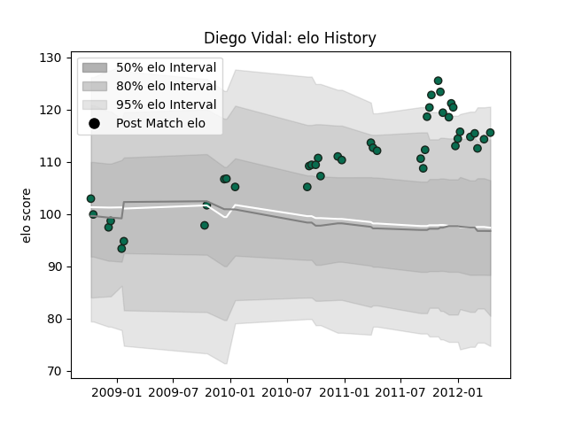

---  
layout: page  
title: Diego Vidal  
date: 2023-03-09 10:08:46.114088  
categories: player  
---
# Diego Vidal

## Positions: H, FB

## Current elo: 116.0

## Current Percentile: 87.0

# Elo History

# Match History

| Team             |   Appearances |   Win Rate |
|:-----------------|--------------:|-----------:|
| Benetton Treviso |            42 |   0.333333 |

| Opponent           |   Matches |   Win Rate |
|:-------------------|----------:|-----------:|
| Scarlets           |         5 |   0.4      |
| Dragons            |         4 |   0.75     |
| Ospreys            |         4 |   0        |
| Perpignan          |         4 |   0.25     |
| Aironi             |         3 |   0.666667 |
| Leicester Tigers   |         3 |   0        |
| Munster            |         3 |   0        |
| Biarritz Olympique |         2 |   0.5      |
| Cardiff Blues      |         2 |   0        |
| Connacht           |         2 |   0.5      |
| Glasgow Warriors   |         2 |   1        |
| Leinster           |         2 |   0.5      |
| Northampton Saints |         2 |   0        |
| Ulster             |         2 |   0.5      |
| Edinburgh          |         1 |   0        |
| Saracens           |         1 |   0        |