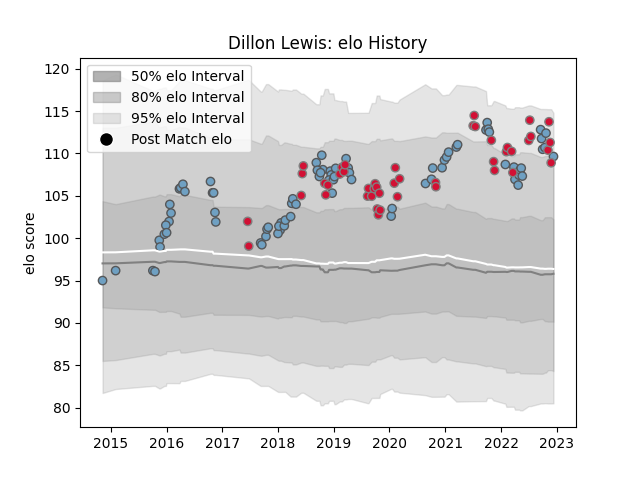

---  
layout: page  
title: Dillon Lewis  
date: 2022-11-16 11:31:09.164733  
categories: player  
---
# Dillon Lewis

## Positions: P

## Country: Wales

## Current elo: 113.0

## Current Percentile: 92.0

# Elo History

# Match History

| Team          |   Appearances |   Win Rate |
|:--------------|--------------:|-----------:|
| Cardiff Blues |            81 |   0.54321  |
| Wales         |            43 |   0.593023 |

| Opponent            |   Matches |   Win Rate |
|:--------------------|----------:|-----------:|
| Scarlets            |        11 |   0.545455 |
| Ospreys             |         8 |   0        |
| Dragons             |         7 |   1        |
| South Africa        |         6 |   0.5      |
| Argentina           |         5 |   0.7      |
| Munster             |         5 |   0.4      |
| Glasgow Warriors    |         5 |   0.2      |
| Benetton Treviso    |         5 |   0.6      |
| Ireland             |         4 |   0.25     |
| Scotland            |         4 |   0.75     |
| England             |         4 |   0.5      |
| France              |         4 |   0.25     |
| Connacht            |         4 |   0.5      |
| New Zealand         |         3 |   0        |
| Lyon                |         3 |   1        |
| Australia           |         3 |   1        |
| Italy               |         3 |   0.666667 |
| Zebre               |         3 |   0.666667 |
| Edinburgh           |         3 |   1        |
| Calvisano           |         3 |   1        |
| Cheetahs            |         3 |   0.666667 |
| Harlequins          |         2 |   0        |
| Ulster              |         2 |   0.5      |
| Stade Toulousain    |         2 |   1        |
| Newcastle Falcons   |         2 |   1        |
| Saracens            |         2 |   0        |
| Fiji                |         2 |   1        |
| Leinster            |         2 |   0.5      |
| Montpellier Herault |         1 |   0        |
| Exeter Chiefs       |         1 |   0        |
| Canada              |         1 |   1        |
| Samoa               |         1 |   1        |
| Georgia             |         1 |   1        |
| Lions               |         1 |   0        |
| Bulls               |         1 |   0        |
| Sharks              |         1 |   1        |
| Bristol Rugby       |         1 |   1        |
| Stormers            |         1 |   1        |
| Tonga               |         1 |   1        |
| Leicester Tigers    |         1 |   0        |
| Uruguay             |         1 |   1        |
| Wasps               |         1 |   1        |