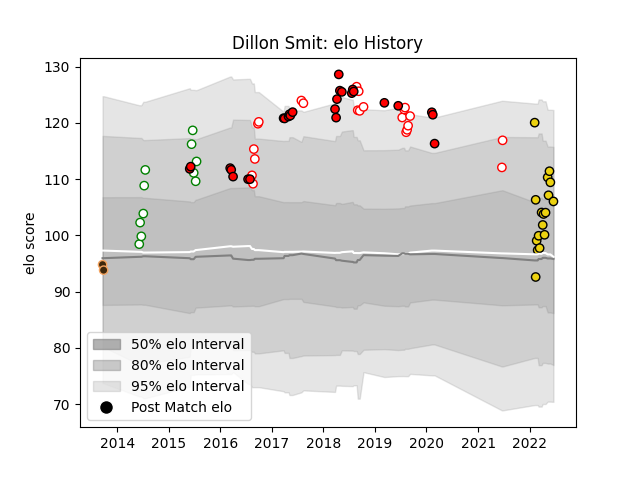

---  
layout: page  
title: Dillon Smit  
date: 2023-03-17 17:20:42.833656  
categories: player  
---
# Dillon Smit

## Positions: SH

## Current elo: 106.0

## Current Percentile: 80.0

# Elo History

# Match History

| Team              |   Appearances |   Win Rate |
|:------------------|--------------:|-----------:|
| Lions             |            27 |   0.574074 |
| Golden Lions      |            22 |   0.636364 |
| Houston SaberCats |            17 |   0.529412 |
| Leopards          |            11 |   0.818182 |
| Border Bulldogs   |             2 |   0.5      |

| Opponent                 |   Matches |   Win Rate |
|:-------------------------|----------:|-----------:|
| Griquas                  |         6 |   0.5      |
| Pumas                    |         4 |   0.75     |
| New South Wales Waratahs |         4 |   0.75     |
| Jaguares                 |         4 |   0.5      |
| Natal Sharks             |         3 |   0.333333 |
| Free State Cheetahs      |         3 |   0.666667 |
| Stormers                 |         3 |   0.5      |
| Seattle Seawolves        |         3 |   0.333333 |
| Blue Bulls               |         3 |   0.333333 |
| Highlanders              |         3 |   0.333333 |
| Western Province         |         3 |   0.666667 |
| Crusaders                |         3 |   0        |
| Boland Cavaliers         |         3 |   1        |
| Griffons                 |         2 |   1        |
| San Diego Legion         |         2 |   0.5      |
| Dallas Jackals           |         2 |   1        |
| L. A. Giltinis           |         2 |   0.5      |
| Valke                    |         2 |   1        |
| Utah Warriors            |         2 |   1        |
| Southern Kings           |         2 |   1        |
| Queensland Reds          |         2 |   0.5      |
| Eastern Province Kings   |         2 |   0.5      |
| SWD Eagles               |         2 |   1        |
| Western Force            |         1 |   1        |
| Toronto Arrows           |         1 |   1        |
| Sharks                   |         1 |   1        |
| Border Bulldogs          |         1 |   1        |
| Rugby ATL                |         1 |   0        |
| Rugby New York           |         1 |   0        |
| R.U. New York            |         1 |   0        |
| Brumbies                 |         1 |   1        |
| Old Glory DC             |         1 |   1        |
| Bulls                    |         1 |   0        |
| Cheetahs                 |         1 |   1        |
| Melbourne Rebels         |         1 |   1        |
| Leopards                 |         1 |   1        |
| Austin Gilgronis         |         1 |   0        |