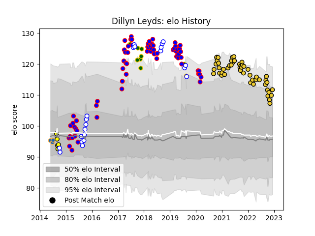

---  
layout: page  
title: Dillyn Leyds  
date: 2023-01-06 00:18:37.495204  
categories: player  
---
# Dillyn Leyds

## Positions: W, FB

## Country: South Africa

## Current elo: 115.0

## Current Percentile: 79.0

# Elo History

# Match History

| Team             |   Appearances |   Win Rate |
|:-----------------|--------------:|-----------:|
| Stormers         |            70 |   0.528571 |
| La Rochelle      |            52 |   0.576923 |
| Western Province |            24 |   0.708333 |
| South Africa     |            11 |   0.681818 |
| Perth Spirit     |             6 |   0.333333 |
| Western Force    |             3 |   0.333333 |

| Opponent                 |   Matches |   Win Rate |
|:-------------------------|----------:|-----------:|
| Sharks                   |         8 |   0.375    |
| Bulls                    |         8 |   0.75     |
| Lions                    |         7 |   0.357143 |
| Stade Toulousain         |         6 |   0        |
| Blues                    |         6 |   0.5      |
| Jaguares                 |         6 |   0.666667 |
| Brive                    |         5 |   0.8      |
| Cheetahs                 |         5 |   0.8      |
| Free State Cheetahs      |         5 |   0.6      |
| Racing 92                |         5 |   0.6      |
| France                   |         4 |   1        |
| Montpellier Herault      |         4 |   0.5      |
| Natal Sharks             |         4 |   0.5      |
| Sunwolves                |         4 |   0.75     |
| Perpignan                |         4 |   0.75     |
| Hurricanes               |         4 |   0.25     |
| Highlanders              |         4 |   0.25     |
| Golden Lions             |         4 |   0.5      |
| Pumas                    |         4 |   1        |
| Clermont Auvergne        |         4 |   0.25     |
| Chiefs                   |         4 |   0.25     |
| Castres Olympique        |         4 |   0.75     |
| Brumbies                 |         4 |   0.5      |
| Crusaders                |         4 |   0.125    |
| Bordeaux Begles          |         4 |   0.75     |
| Blue Bulls               |         3 |   0.666667 |
| Griquas                  |         3 |   1        |
| Bayonne                  |         3 |   0.666667 |
| Melbourne Rebels         |         3 |   1        |
| Toulon                   |         2 |   0.5      |
| Australia                |         2 |   0.75     |
| Pau                      |         2 |   0.5      |
| Biarritz Olympique       |         2 |   0.5      |
| New South Wales Waratahs |         2 |   0.5      |
| Lyon                     |         2 |   1        |
| Queensland Reds          |         2 |   0.5      |
| Agen                     |         2 |   1        |
| Stade Francais Paris     |         1 |   0        |
| Southern Kings           |         1 |   1        |
| Wales                    |         1 |   0        |
| Ulster                   |         1 |   1        |
| Sydney Stars             |         1 |   1        |
| Italy                    |         1 |   1        |
| Northampton Saints       |         1 |   1        |
| North Harbour Rays       |         1 |   0        |
| New Zealand              |         1 |   0        |
| Melbourne Rising         |         1 |   0        |
| Argentina                |         1 |   1        |
| Ireland                  |         1 |   0        |
| Greater Sydney Rams      |         1 |   0        |
| Eastern Province Kings   |         1 |   1        |
| Canberra Vikings         |         1 |   1        |
| Brisbane City            |         1 |   0        |
| Western Force            |         1 |   1        |